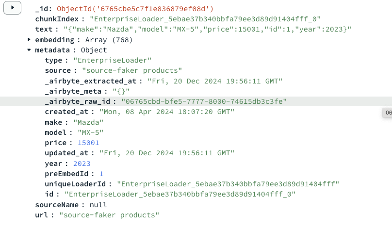

# Enterprise Data Loaders

This data loader facilitate the seamless integration of data into MongoDB's vector store, leveraging specific embedding models. They are designed to support the construction of gen AI application.


## Loaders with their usage
Currently the support of multiple enterprise data sources are extend throught the pyairbyte service that can be hosted following steps in [pyairbyte-svc github repo](!https://github.com/ashwin-gangadhar-mdb/pyairbyte-svc).
The usage steps defines what values are required to be set by the user in the `config.yaml` file to work with the loader. 
Multiple data sources can be configured at the same time to ingest data by decalring their respective configurations.
The Enterprise data loader is extension to the exisiting data loader and works along side the [Data Loaders](!data-loader.md)

### Loader Example format to test Data Load

Used to load and ingest content directly from Google drive spaces by specifying the necessary credentials and configuration.

**Usage:**
```js
ingest:
    - source: 'enterprise'
      connectorName: 'source-faker'
      connectorConfigPath: '/path/to/your/ent_connector_config.json'
      filterStream: 'products'
      pickKeysForEmbedding: 
          - 'make'
          - 'model'
          - 'price'
          - 'id'
          - 'year'
```
Sample Data format in MongoDB once the ingest command is run from the console

---
### 1. Gdrive Loader

  #### Prerequisites:
    - A GCP project
    - Enable the Google Drive API in your GCP project
    - Service Account Key with access to the Spreadsheet you want to replicate

  #### Set up the service account key (Airbyte Open Source)

  ##### Create a service account

    - Open the [Service Accounts page](https://console.cloud.google.com/projectselector2/iam-admin/serviceaccounts) in your Google Cloud console.
    - Select an existing project, or create a new project.
    - At the top of the page, click **+ Create service account**.
    - Enter a name and description for the service account, then click **Create and Continue**.
    - Under **Service account permissions**, select the roles to grant to the service account, then click **Continue**. We recommend the **Viewer** role.

  ##### Generate a key
    - Go to the [API Console/Credentials](https://console.cloud.google.com/apis/credentials) page and click on the email address of the service account you just created.
    - In the **Keys** tab, click **+ Add key**, then click **Create new key**.
    - Select **JSON** as the Key type. This will generate and download the JSON key file that you'll use for authentication. Click **Continue**.

  ##### Enable the Google Drive API
    - Go to the [API Console/Library](https://console.cloud.google.com/apis/library) page.
    - Make sure you have selected the correct project from the top.
    - Find and select the **Google Drive API**.
    - Click **ENABLE**.

  If your folder is viewable by anyone with its link, no further action is needed. If not, give your Service account access to your folder.

  ##### Setting up the config file

  If you are successfully able to complete all the above steps you will get a `svc-acc-key.json` file that has the following format:

```js
{ 
  "type": "service_account", 
  "project_id": "YOUR_PROJECT_ID", 
  "private_key_id": "YOUR_PRIVATE_KEY", 
  ...
}
```

  Create a JSON file `ent_connector_config.json` in your `builder/partnerproduct/src` folder. Add the following fields in it as follows:

```js
{ 
  "folder_url": "https://drive.google.com/drive/folders/your-folder-id", 
  "credentials": { 
    "auth_type": "Service", 
    "service_account_info": "your-service-account-json-as-shown-above" 
  }, 
  "streams": [ 
    { 
      "name": "your-stream-name", 
      "globs": ["**/*.csv"], 
      "format": {"filetype": "csv"}, 
      "validation_policy": "Emit Record", 
      "days_to_sync_if_history_is_full": 3 
    } 
  ] 
}
```

  Create a Loader config in your `config.yaml`. Key names mentioned under `pickKeysForEmbedding` will merge all the required fields into the document and concatenate them as a single field. See the example of Sample Data format for reference.

```yaml
ingest:
  - source: 'enterprise'
    connectorName: 'source-google-drive'
    connectorConfigPath: '/path/to/your/ent_connector_config.json'
    filterStream: 'your-stream-name'
    pickKeysForEmbedding:
      - your-field-name1
      - your-field-name2
      - ...
```

---


### 2. Salesforce Loader

  Prerequisites:
    - [Salesforce Account](https://login.salesforce.com/) with Enterprise access or API quota purchased
    - (Optional, Recommended) Dedicated Salesforce [user](https://help.salesforce.com/s/articleView?id=adding_new_users.htm&type=5&language=en_US)
    - (For Airbyte Open Source) Salesforce [OAuth](https://help.salesforce.com/s/articleView?id=sf.remoteaccess_oauth_tokens_scopes.htm&type=5) credentials
    -You will need to obtain the following OAuth credentials to authenticate:
      1. Client ID
      2. Client Secret
      3. Refresh Token


  #### Fetch the required credential for Salesforce Account
  To obtain these credentials, follow [this walkthrough](https://medium.com/@bpmmendis94/obtain-access-refresh-tokens-from-salesforce-rest-api-a324fe4ccd9b) with the following modifications:

    -  If your Salesforce URL is not in the `X.salesforce.com` format, use your Salesforce domain name. For example, if your Salesforce URL is `awesomecompany.force.com` then use that instead of `awesomecompany.salesforce.com`.
    -  When running a curl command, run it with the `-L` option to follow any redirects.
    -  If you created a read-only user, use the user credentials when logging in to generate OAuth tokens.


  ##### Setting up the config file
    
    Once you are able to fetch the above mentioned fields you can configure the `ent_connector_config.json` in the following format
```js
{ "client_id": "your-client-id", "client_secret": "your-client-secret", "refresh_token": "your-refresh-token", "is_sandbox": False, "start_date": "2023-01-01T00:00:00Z" }
```
  Create a Loader config in your `config.yaml`. Key names mentioned under `pickKeysForEmbedding` will merge all the required fields into the document and concatenate them as a single field. See the example of Sample Data format for reference.

```yaml
ingest:
  - source: 'enterprise'
    connectorName: 'source-salesforce'
    connectorConfigPath: '/path/to/your/ent_connector_config.json'
    filterStream: 'your-stream-name'
    pickKeysForEmbedding:
      - your-field-name1
      - your-field-name2
      - ...
```

    #### Supported usage with connector
    Airbyte allows exporting all available Salesforce objects dynamically based on:

    - If the authenticated Salesforce user has the Role and Permissions to read and fetch objects. This would be set as part of the Permission Set you assign to the Airbyte user.
    - If the Salesforce object has the queryable property set to true. Airbyte can only fetch objects which are queryable. If you don’t see an object available via Airbyte, and it is queryable, check if it is API-accessible to the Salesforce user you authenticated with.

---

### 3. Slack Loader

#### Prerequisites:
  - Administrator access to an active Slack Workspace
  - Slack App OAuth (preferred) or API Key

#### Set up Slack

The following instructions guide you through creating a Slack app. Airbyte can only replicate messages from channels that the app has been added to.

:::info
If you are using a legacy Slack API Key, you can skip this section.
:::

To create a Slack App, read this [tutorial](https://api.slack.com/tutorials/tracks/getting-a-token) on how to create an app, or follow these instructions. 

- Go to your [Apps](https://api.slack.com/apps)
- Click **Create New App**. Select **From Scratch**.
- Choose a name for your app and select the name of your Slack workspace. Click **Create App**. 
- In the navigation menu, select **OAuth & Permissions**.
- Navigate to **Scopes**. In **Bot Token Scopes**, select the following scopes: 

```
 channels:history
 channels:join
 channels:read
 files:read
 groups:read
 links:read
 reactions:read
 remote_files:read
 team:read
 usergroups:read
 users:read
 users.profile:read
```
- At the top of the "OAuth & Permissions" page, click **Install to Workspace**. This will generate a Bot User OAuth Token. Copy this for later if you are using the API token for authentication.
- Go to your Slack instance. For any public channel, go to **Info**, **More**, and select **Add Apps**. 
- Search for your newly created app. (If you are using the desktop version of Slack, you may need to restart Slack for it to pick up the new App). Add the App to all channels you want to sync data from.

:::note
If you are using an API key to authenticate to Slack, a refresh token is not required, as acccess tokens never expire. You can learn more about refresh tokens [here](https://api.slack.com/authentication/rotation).
:::

##### Setting up the config file
Once you are able to fetch the above mentioned fields you can configure the `ent_connector_config.json` in the following format
```js
{ "token": "your-bot-user-oauth-token", "start_date": "2023-01-01T00:00:00Z", "join_channels": True, "include_private_channels": False }
```
Create a Loader config in your `config.yaml`. Key names mentioned under `pickKeysForEmbedding` will merge all the required fields into the document and concatenate them as a single field. See the example of Sample Data format for reference.

```yaml
ingest:
  - source: 'enterprise'
    connectorName: 'source-slack'
    connectorConfigPath: '/path/to/your/ent_connector_config.json'
    filterStream: 'your-stream-name'
    pickKeysForEmbedding:
      - your-field-name1
      - your-field-name2
      - ...
```

##### Supported Streams

For most of the streams, the Slack source connector uses the [Conversations API](https://api.slack.com/docs/conversations-api) under the hood.

- [Channels \(Conversations\)](https://api.slack.com/methods/conversations.list)
- [Channel Members \(Conversation Members\)](https://api.slack.com/methods/conversations.members)
- [Messages \(Conversation History\)](https://api.slack.com/methods/conversations.history) It will only replicate messages from non-archive, public and private channels that the Slack App is a member of.
- [Users](https://api.slack.com/methods/users.list)
- [Threads \(Conversation Replies\)](https://api.slack.com/methods/conversations.repli
