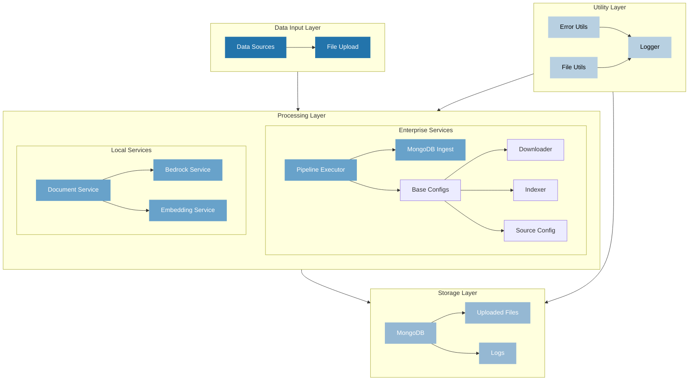

# Data Loader

The `maap-data-loader` project is designed to streamline data ingestion and processing for the MongoDB Atlas Application Partner (MAAP) program. This tool provides a robust mechanism to load, transform, and manage data efficiently, ensuring seamless integration with MongoDB Atlas. It supports both structured and unstructured data processing, with built-in support for document processing, embeddings generation, and integration with various AI services.

## Features
- **Document Processing**: Automated processing of various document formats
- **Embedding Generation**: Built-in support for generating embeddings using AI services
- **MongoDB Integration**: Direct integration with MongoDB Atlas for efficient data storage
- **Configurable Pipeline**: Flexible pipeline configuration for different data processing needs
- **Logging System**: Comprehensive logging system for tracking operations
- **Enterprise Support**: Dedicated enterprise features for large-scale deployments

## Reference Architecture


### Component Description

#### Input Layer
- **Data Sources**: Various input sources including files, APIs, and streams
- **File Upload**: Handles file ingestion and initial validation

#### Processing Layer
- **Enterprise Services**
  - Pipeline Executor: Orchestrates data processing workflows
  - MongoDB Ingest: Handles data ingestion into MongoDB
  - Configuration Components: Manages processing settings
- **Local Services**
  - Document Service: Processes and transforms documents
  - Bedrock Service: AWS Bedrock integration for AI capabilities
  - Embedding Service: Generates embeddings for documents

#### Storage Layer
- **MongoDB**: Primary data store
- **Uploaded Files**: Temporary storage for processed files
- **Logs**: Application logging and monitoring

#### Utility Layer
- **Error Utils**: Error handling and reporting
- **File Utils**: File system operations
- **Logger**: Logging and monitoring utilities


## Project Structure
The project is organized as follows:

```
maap-data-loader/
├── app.py                 # Main application entry point
├── config.py             # Global configuration settings
├── Dockerfile            # Container definition for deployment
├── requirements.txt      # Python dependencies
├── enterprise/          # Enterprise-specific implementations
│   ├── mongodb_ingest.py     # MongoDB ingestion logic
│   ├── pipeline_executor.py  # Data pipeline execution
│   └── util/                 # Enterprise utilities
│       ├── base_configs.py   # Base configuration classes
│       ├── builder.py        # Pipeline builder
│       └── configs/          # Configuration components
│           ├── downloader.py # Data download configurations
│           ├── indexer.py    # Indexing configurations
│           └── source.py     # Data source configurations
├── local/               # Local development components
│   ├── database/        # Database interactions
│   ├── models/          # Data models and schemas
│   ├── services/        # Core services
│   │   ├── bedrock_service.py    # AWS Bedrock integration
│   │   ├── document_service.py   # Document processing
│   │   └── embedding_service.py  # Embedding generation
│   └── utils/           # Utility functions
```

## Prerequisites
- Python 3.8 or higher
- MongoDB Atlas account
- Docker (for containerized deployment)
- AWS account (for Bedrock service integration)
- Sufficient storage for document processing

## Setup Instructions

1. **Clone the Repository**  
   ```bash
   git clone https://github.com/mongodb-partners/maap-data-loader.git
   cd maap-data-loader
   ```

2. **Quick Setup Using Make**  
   The project includes a Makefile for common operations. To get started quickly:
   ```bash
   # View all available commands
   make help

   # Set up virtual environment and install dependencies
   make setup

   # Install additional development dependencies
   make install-dev
   ```

   For other operations:
   ```bash
   make test        # Run tests
   make lint        # Run linting and formatting
   make run         # Run the application
   make clean       # Clean up build artifacts
   make docker-build # Build Docker image
   make docker-run  # Run Docker container
   make logs        # View application logs
   make backup      # Backup processed data
   ```

3. **Manual Setup**  
   If not using Makefile, perform the following steps:

   1. **Set Up Python Environment**  
      ```bash
      python -m venv venv
      source venv/bin/activate  # On Windows: venv\Scripts\activate
      pip install -r requirements.txt
      ```

   2. **Configure Environment Variables**  
      Create a `.env` file in the root directory with the following variables:
      ```
      MONGODB_URI=your_mongodb_connection_string
      AWS_ACCESS_KEY_ID=your_aws_access_key
      AWS_SECRET_ACCESS_KEY=your_aws_secret_key
      AWS_REGION=your_aws_region
      ```

   3. **Configure Application Settings**  
      Update `config.py` with your specific settings:
      - Database configurations
      - Processing pipeline settings
      - Document processing parameters
      - Embedding service configurations

   4. **Run the Application**  
      ```bash
      python app.py
      ```

## Usage Examples

### Basic Document Processing
```python
from local.services.document_service import DocumentService
from local.services.embedding_service import EmbeddingService

# Initialize services
doc_service = DocumentService()
embedding_service = EmbeddingService()

# Process a document
processed_doc = doc_service.process("path/to/document")
embeddings = embedding_service.generate(processed_doc)
```

### Enterprise Pipeline Execution
```python
from enterprise.pipeline_executor import PipelineExecutor
from enterprise.util.builder import PipelineBuilder

# Configure pipeline
pipeline = PipelineBuilder()\
    .add_source("file_system")\
    .add_processor("document")\
    .add_sink("mongodb")\
    .build()

# Execute pipeline
executor = PipelineExecutor(pipeline)
executor.run()
```

## Monitoring and Logging
- Logs are stored in `local/logs/MAAP-Loader.log`
- Monitor MongoDB operations through Atlas dashboard
- Check processing status in application logs

## Container Deployment
Build and run using Docker:
```bash
docker build -t maap-data-loader .
docker run -d --env-file .env maap-data-loader
```

## Best Practices
- Always use virtual environments
- Keep sensitive information in environment variables
- Regular backup of processed data
- Monitor system resources during large-scale processing
- Use appropriate indexes in MongoDB for better query performance

## Troubleshooting
Common issues and solutions:
1. **Connection Errors**: Verify MongoDB URI and network connectivity
2. **Memory Issues**: Check document size and processing batch size
3. **Processing Errors**: Verify file formats and permissions
4. **AWS Integration**: Confirm AWS credentials and permissions

## Contributing
1. Fork the repository
2. Create a feature branch
3. Submit a pull request with detailed description
4. Ensure tests pass and code meets style guidelines

## License
This project is licensed under the MIT License - see the LICENSE file for details.