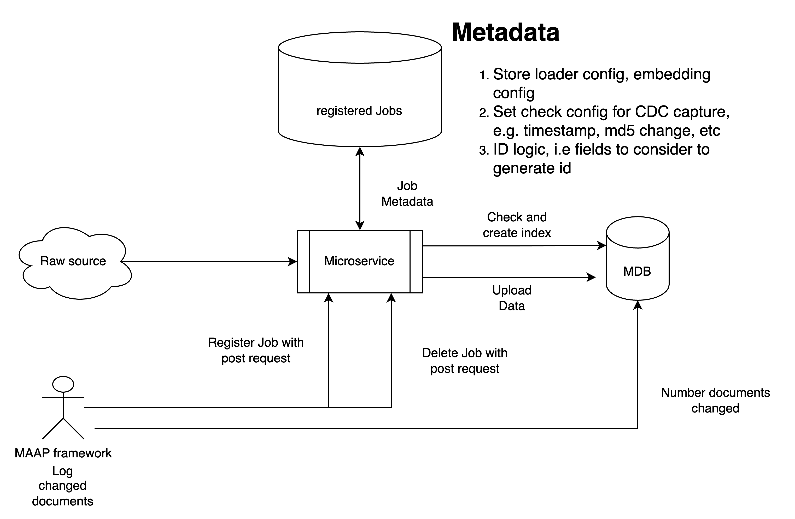

# Enterprise Data Loader (Using unstructured)

## Table of Contents

1. [Overview](#overview)
2. [System Architecture](#system-architecture)
3. [Installation & Deployment](#installation--deployment)
4. [Usage](#usage)
5. [API Reference](#api-reference)

### Overview

The MAAP Data Loader application is designed to synchronize data from various sources (local filesystems, S3 buckets, Google Drive) to a MongoDB database using [unstructured.io](https://unstructured.io) (MAAP Partner). 


[Unstructured](https://unstructured.io) is a platform that specializes in processing and structuring unstructured data for seamless integration and analysis. It provides a flexible and efficient way to ingest, process, and store unstructured data, making it easily accessible for further analysis and use.

[](https://github.com/mongodb-partners/maap-data-loader)

**Key features include:**
- Support for multiple data sources (local, S3, Google Drive)
- Configurable sync intervals
- Data processing pipeline including partitioning, chunking, and embedding
- RESTful API for controlling sync operations
- Customizable MongoDB ingestion with duplicate handling

This system is ideal for organizations needing to centralize and structure data from diverse sources, enabling seamless data integration and analysis.

### System Architecture

The MAAP Data Loader application follows a modular architecture, consisting of several key components:

1. **FastAPI Application**: Provides RESTful API endpoints for controlling the sync process.
2. **Configuration Manager**: Handles loading and parsing of the YAML configuration file.
3. **Data Pipeline**: Orchestrates the data processing flow, including:
   - Source Connectors (Local, S3, Google Drive)
   - Indexer
   - Downloader
   - Partitioner
   - Chunker
   - Embedder
   - MongoDB Uploader
4. **MongoDB Integration**: Manages connections and data ingestion to the MongoDB database.
5. **Background Task Manager**: Handles periodic sync operations asynchronously.

**Reference Architecture:**



This architecture ensures scalability, modularity, and ease of maintenance, allowing for future extensions and modifications to the system.

### Installation & Deployment

To install and deploy the MAAP Data Loader application, follow these steps:

1. **Prerequisites:**
   - Python 3.7 or higher
   - pip (Python package manager)
   - Access to a MongoDB instance
   - Docker

2. **Clone the repository:**
   ```sh
   git clone https://github.com/mongodb-partners/maap-data-loader.git
   cd maap-data-loader
   ```

3. **Build the Docker image:**
   ```sh
   make install
   ```

4. **Running the Docker image:**
   ```sh
   make run
   ```

### Usage

To access the application, you can use the following `curl` command to interact with the API hosted on `localhost:8182`:


1. **Register Source**
   - **Endpoint:** `/register/source`
   - **Method:** GET
   - **Description:** Registers a new data source for synchronization
   - **Curl Command:**
      -  ***Local Source*** : 
      ```sh
      curl --location --request GET 'localhost:8182/register/source' \
      --header 'Content-Type: application/json' \
      --data-raw '{"sync_interval_seconds": 360, "source": {"source_type": "local", "params": {"remote_url": "<source-url-folder-path>", "chunking_strategy": "by_title", "chunk_max_characters": "1500", "chunk_overlap": "100"}}, "destination": {"mongodb_uri": "<your-mongodb-connection-string>", "database": "<your-db-name>", "collection": "<your-collection-name>", "index_name": "default", "embedding_path": "embeddings", "embedding_dimensions": embedding-model-dims, "id_fields": ["field1","field2" ], "create_md5": true, "batch_size": 100}}'
      ```

      -  ***S3***
     ```sh
      curl --location --request GET 'localhost:8182/register/source' \
      --header 'Content-Type: application/json' \
      --data-raw '{"sync_interval_seconds": 360, "source": {"source_type": "s3", "credentials": {"aws_access_key_id": "<your-aws-access-key-id>", "aws_secret_access_key": "<your-aws-secret-key>", "aws_session_token": "<your-aws-session-token>"}, "params": {"remote_url": "<source-url-folder-path>", "chunking_strategy": "by_title", "chunk_max_characters": "1500", "chunk_overlap": "100"}}, "destination": {"mongodb_uri": "<your-mongodb-connection-string>", "database": "<your-db-name>", "collection": "<your-collection-name>", "index_name": "default", "embedding_path": "embeddings", "embedding_dimensions": embedding-model-dims, "id_fields": ["field1","field2" ], "create_md5": true, "batch_size": 100}}'
      ```

      -  ***Google Drive***
     ```sh
      curl --location --request GET 'localhost:8182/register/source' \
      --header 'Content-Type: application/json' \
      --data-raw '{"sync_interval_seconds": 360, "source": {"source_type": "google-drive", "credentials": {"gcp_service_account_key_string": "<gcp_service_account_key_string>", "google_drive_folder_id": "<google_drive_folder_id>"}, "params": {"remote_url": "<source-url-folder-path>", "chunking_strategy": "by_title", "chunk_max_characters": "1500", "chunk_overlap": "100"}}, "destination": {"mongodb_uri": "<your-mongodb-connection-string>", "database": "<your-db-name>", "collection": "<your-collection-name>", "index_name": "default", "embedding_path": "embeddings", "embedding_dimensions": embedding-model-dims, "id_fields": ["field1","field2" ], "create_md5": true, "batch_size": 100}}'
      ```

   - **Response:**
     ```json
     {
       "message": "Source registered successfully."
     }
     ```

2. **Delete Source**
   - **Endpoint:** `/delete/source`
   - **Method:** GET
   - **Description:** Deletes an existing data source from synchronization
   - **Curl Command:**
      -  ***Local Source*** : 
      ```sh
      curl --location --request GET 'localhost:8182/delete/source' \
      --header 'Content-Type: application/json' \
      --data-raw '{"sync_interval_seconds": 360, "source": {"source_type": "local", "params": {"remote_url": "<source-url-folder-path>", "chunking_strategy": "by_title", "chunk_max_characters": "1500", "chunk_overlap": "100"}}, "destination": {"mongodb_uri": "<your-mongodb-connection-string>", "database": "<your-db-name>", "collection": "<your-collection-name>", "index_name": "default", "embedding_path": "embeddings", "embedding_dimensions": embedding-model-dims, "id_fields": ["field1","field2" ], "create_md5": true, "batch_size": 100}}'
      ```

      -  ***S3***
     ```sh
      curl --location --request GET 'localhost:8182/delete/source' \
      --header 'Content-Type: application/json' \
      --data-raw '{"sync_interval_seconds": 360, "source": {"source_type": "s3", "credentials": {"aws_access_key_id": "<your-aws-access-key-id>", "aws_secret_access_key": "<your-aws-secret-key>", "aws_session_token": "<your-aws-session-token>"}, "params": {"remote_url": "<source-url-folder-path>", "chunking_strategy": "by_title", "chunk_max_characters": "1500", "chunk_overlap": "100"}}, "destination": {"mongodb_uri": "<your-mongodb-connection-string>", "database": "<your-db-name>", "collection": "<your-collection-name>", "index_name": "default", "embedding_path": "embeddings", "embedding_dimensions": embedding-model-dims, "id_fields": ["field1","field2" ], "create_md5": true, "batch_size": 100}}'
      ```

      -  ***Google Drive***
     ```sh
      curl --location --request GET 'localhost:8182/delete/source' \
      --header 'Content-Type: application/json' \
      --data-raw '{"sync_interval_seconds": 360, "source": {"source_type": "google-drive", "credentials": {"gcp_service_account_key_string": "<gcp_service_account_key_string>", "google_drive_folder_id": "<google_drive_folder_id>"}, "params": {"remote_url": "<source-url-folder-path>", "chunking_strategy": "by_title", "chunk_max_characters": "1500", "chunk_overlap": "100"}}, "destination": {"mongodb_uri": "<your-mongodb-connection-string>", "database": "<your-db-name>", "collection": "<your-collection-name>", "index_name": "default", "embedding_path": "embeddings", "embedding_dimensions": embedding-model-dims, "id_fields": ["field1","field2" ], "create_md5": true, "batch_size": 100}}'
      ```

   - **Response:**
     ```json
     {
       "message": "Source deleted successfully."
     }
     ```

The application will periodically sync data from the configured sources to the MongoDB destination based on the specified interval.


### Further Enhancements 

Unstructured handles various data sources by providing a unified interface for data ingestion. It supports connectors for local filesystems, S3 buckets, Google Drive, and more. Each connector is designed to manage the specifics of data retrieval and preprocessing, ensuring that data from different sources can be seamlessly integrated into the pipeline.

The tool can be enhanced by adding other [source connectors](https://docs.unstructured.io/open-source/ingest/source-connectors/overview) such as FTP, Dropbox, or custom APIs. This would involve implementing new source connector classes that adhere to the existing data pipeline architecture. Each new connector should handle authentication, data retrieval, and any necessary preprocessing steps.

To contribute a new source connector, you can fork the repository, create a new branch, implement the connector, and thoroughly test it. Once done, you can raise a pull request with a detailed description of the changes and any relevant documentation updates. The maintainers will review the pull request and provide feedback or merge it into the main branch.

For more details on contributing, refer to the [contributing guidelines](https://github.com/maap-partners/maap-data-loader/).
