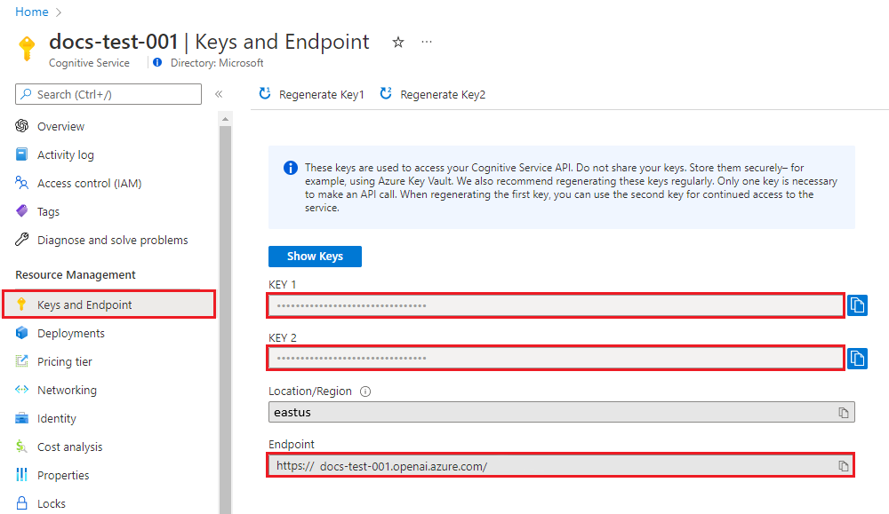

# Azure

## Introduction

[Azure OpenAI](https://azure.microsoft.com/en-in/products/ai-services/openai-service) Service offers REST API access to advanced language models like GPT-4, GPT-4 Turbo with Vision, GPT-3.5-Turbo, and Embeddings models. Both GPT-4 and GPT-3.5-Turbo models are now generally available, empowering users with capabilities such as content generation, summarization, image understanding, semantic search, and natural language to code translation. Accessible through REST APIs, Python SDK, or the Azure OpenAI Studio web interface, these models can be seamlessly integrated into various applications.


## Deploying your model

Azure OpenAI Studio, offers the capability to deploy both Chat Models(LLM) as well as Embedding Models from the console.


### Chat Model 

Go through the Azure [documentation](https://learn.microsoft.com/en-us/azure/ai-services/openai/how-to/create-resource?pivots=web-portal) and start deploying your model. You can test out the model in Azure OpenAI Studio > Chat Playground. Here is a [Quick Start](https://learn.microsoft.com/en-us/azure/ai-services/openai/chatgpt-quickstart) to help you in the process.

Once your model is deployed successfully, you can use it to serve the LLM purpose in the MAAP framework.

#### Usage with MAAP
To use Azure OpenAI model with MAAP framework, you would need to feed below values.

- #### Config File :
  Provided below are the values required to be added in `config.yaml` file in LLM section.
  ```
  llms:
      class_name: AzureOpenAI
  ```
  
  - ##### Llamaindex Framework:

  MAAP now provides the option to choose if you want to use LlamaIndex as your main framework to deploy your LLM models.

  This can be done by adding the 'framework' configuration to the config.yaml file

  ```
  llms:
      class_name: AzureOpenAI
      model_name: <check_references_below>
      framework: llamaindex
  ```
  
  > Llamaindex requires a provided model name.

- #### Environment Variable :
  Below value(s) are to be added in `.env` file, present at `builder/partnerproduct/`.

  ```
  AZURE_OPENAI_API_KEY=<check_references_below>
  AZURE_OPENAI_API_INSTANCE_NAME=<check_references_below>
  AZURE_OPENAI_API_VERSION=<check_references_below>
  AZURE_OPENAI_API_DEPLOYMENT_NAME=<check_references_below>
  ```


### Embedding Model

You can follow the same steps as above to deploy the embedding model as well. The process is documented [here](https://learn.microsoft.com/en-us/azure/ai-services/openai/how-to/create-resource).


#### Usage with MAAP
To use Azure OpenAI embedding with MAAP framework, you would need to feed below values.


- #### Config File :
  Provided below are the values required to be added in `config.yaml` file in embedding section.
  ```
  embedding:
      class_name: Azure-OpenAI-Embeddings
      model_name: <model_selected>
      max_tokens: <integer_value>
      temperature: <integer_value>
  ```


    Model name specified should be one of the below listed:  
    - text-embedding-ada-002
    - text-embedding-3-small
    - text-embedding-3-large


- #### Environment Variable :
  Below value(s) are to be added in `.env` file, present at `builder/partnerproduct/`.

  ```
  AZURE_OPENAI_API_KEY=<check_references_below>
  AZURE_OPENAI_API_INSTANCE_NAME=<check_references_below>
  AZURE_OPENAI_API_EMBEDDINGS_DEPLOYMENT_NAME=<check_references_below>
  AZURE_OPENAI_API_VERSION=<check_references_below>
  ```


### References

Provided below are the instructions on how to procure the right values for building your MAAP framework.

- ##### Deployment Name
  You can pick the deployment name for AZURE_OPENAI_API_EMBEDDINGS_DEPLOYMENT_NAME and AZURE_OPENAI_API_DEPLOYMENT_NAME as shown below from your [console](https://oai.azure.com/portal).

  

  For Llamaindex you can pick the model name from the column of the same name.


- ##### API Key and Instance Name 

  To retrieve the key and instance name, you can go to **Resource Management** in [Azure Portal](https://portal.azure.com/) for your service and copy,

  - `KEY 1` or `KEY 2` for `AZURE_OPENAI_API_KEY`
  - `Endpoint` for `azure_openai_api_instance_name`

  The instance name can be retrieved from the endpoint itself. For example, Instance name for `https://maap-demo.openai.azure.com/` is `maap-demo`.

  


  Refer [here](https://learn.microsoft.com/en-us/azure/ai-services/openai/tutorials/embeddings#retrieve-key-and-endpoint) for further details.

- ##### API Version
  Check the docs [here](https://learn.microsoft.com/en-us/azure/ai-services/openai/reference) to pass the right api-version.