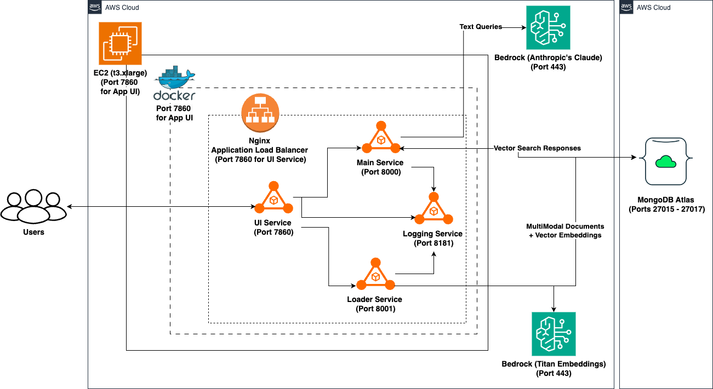

# MongoDB - Anthropic Quickstart

MongoDB - Anthropic Quickstart is an integrated end-to-end technology stack that combines MongoDB Atlas capabilities with Anthropic's Claude AI models to create an intelligent Agentic conversational interface. It allows users to interact with MongoDB data sources through natural language queries, leveraging vector search, full-text search, hybrid search and other advanced querying techniques.

[](https://github.com/mongodb-partners/maap-anthropic-qs)

## Table of Contents
1. [Overview](#1-overview)  
2. [System Architecture](#2-system-architecture)  
3. [Components](#3-components)  
4. [Installation & Deployment](#4-installation--deployment)  
   1. [One-Click Deployment](#41-one-click-deployment)  
5. [Configuration](#5-configuration)  
6. [Usage](#6-usage)  
7. [API Reference](#7-api-reference)  
8. [Security Considerations](#8-security-considerations)  
9. [Monitoring & Logging](#9-monitoring--logging)  
10. [Troubleshooting](#10-troubleshooting)  
11. [Development Guide](#11-development-guide)  
12. [Maintenance & Operations](#12-maintenance--operations)  

## 1. Overview

The MongoDB - Anthropic Quickstart is a comprehensive, integrated end-to-end technology stack meticulously designed to facilitate the rapid development and seamless deployment of AI-powered Agentic applications. This innovative framework combines the robust capabilities of MongoDB Atlas for scalable data storage and advanced vector search functionalities with Anthropic's Claude AI state-of-the-art language models for powerful natural language processing and generation.

Key features include:
- Advanced vector search capabilities for nuanced, contextual information retrieval
- Seamless integration with AWS Bedrock for efficient AI model inference
- Highly intuitive chat interface for natural language querying and streamlined file uploads
- Scalable microservices architecture designed for optimal performance and resource utilization
- Robust data ingestion and processing pipeline capable of handling diverse data types
- Multi-modal file processing for comprehensive data analysis
- Real-time AI interactions for immediate insights and responses
- Stringent security measures to ensure the integrity and confidentiality of all data handled within the system
- Long-term conversation memory for contextual responses
- Support for multiple file types including images, PDFs, and Word documents
- Hybrid search capabilities combining vector and full-text search

This system empowers developers to create sophisticated AI applications that can understand context, process natural language queries, and provide intelligent responses based on ingested data. This makes it an ideal solution for a wide range of applications, from advanced customer support systems and intelligent document analysis tools to complex research assistants and innovative educational platforms.

## 2. System Architecture

The system architecture consists of the following components:

1. **Frontend**: A Gradio-based web interface for user interactions.
2. **Backend Services**:
   - UI Service (Port 7860): Handles user interface and initial request processing.
   - Main Service (Port 8000): Orchestrates AI interactions and database queries.
   - Loader Service (Port 8001): Manages file uploads and data ingestion.
   - Logger Service (Port 8181): Centralized logging service for all components.
3. **Databases**:
   - MongoDB Atlas: Stores document data, embeddings, and chat history.
4. **External Services**:
   - AWS Bedrock: Hosts the Anthropic Claude AI models.
   - AWS Titan Embeddings: Generates embeddings for vector search.

The system uses Docker for containerization and deployment, with Nginx as a reverse proxy for load balancing.



**Data flow within the system:**

Users interact with the Gradio-based frontend UI, which acts as the entry point for all inputs. 

- Text queries or file uploads from users are forwarded to the **UI Service**.  
- For file uploads, the **Loader Service** handles data ingestion and processes content using **AWS Titan Embeddings**, generating vector representations of the input data.  
- These vector embeddings are stored in **MongoDB Atlas**, enabling efficient vector or full-text similarity searches.  
- For text query processing, the **Main Service** coordinates multiple actions:
  - Retrieves relevant information from **MongoDB Atlas** using vector or full-text search.  
  - Handles AI-specific queries by interacting with **AWS Bedrock**, specifically leveraging **Claude AI** for language understanding and generation.  
  - Utilizes **AWS Titan Embeddings** for embedding generation when necessary.  
  - The **Logger Service** provides centralized logging for all components, ensuring comprehensive system monitoring and troubleshooting capabilities.

This system ensures a seamless user experience and leverages advanced AI models for robust query handling and content processing.

This architecture ensures high scalability, allowing the system to handle increasing loads by scaling individual components as needed. It also provides flexibility, enabling easy updates or replacements of specific services without affecting the entire system.

---

### Document Storage and Segmentation in MongoDB

#### Key Fields in MongoDB
Each document uploaded by a user is stored in MongoDB with the following fields:
- `_id`: MongoDB-generated unique identifier for the document.
- `userId`: Unique identifier for the user (e.g., email address or UUID). This field ensures all documents are segmented and associated with their respective users.
- `document_text`: The full text extracted from the uploaded document.
- `document_embedding`: Vector embeddings generated from the `document_text` for similarity-based searches.
- `link_texts`: Anchor texts of hyperlinks within the document.
- `link_urls`: Corresponding URLs for the hyperlinks.
- `languages`: Detected language(s) of the document content.
- `filetype`: The type of file uploaded (e.g., `text/html`).
- `url`: The source URL of the document (if available).
- `category`: The classification or type of the document (e.g., `CompositeElement`).
- `element_id`: A unique identifier for the specific content element.

#### Data Segmentation by User ID
- The `userId` field is critical for isolating and segmenting data. 
- During queries, only the documents associated with a specific `userId` are retrieved, ensuring data privacy and security.
- This segmentation allows for multi-tenant architecture while maintaining strict user data isolation.

---

### Data Upload Process

#### User Actions
1. **Document Upload**: The user uploads a document through the **UI Service** (running on port 7860).
2. **User Identification**: The system captures the user's unique identifier (`userId`) during the upload process provided in the `User Id` text field on the UI.

#### System Workflow
1. **Content Extraction**:
   - The **Loader Service** (running on port 8001) processes the document, extracting:
     - `document_text`: The full textual content.
     - `link_texts` and `link_urls`: Hyperlinked phrases and their corresponding URLs.
   - Additional metadata is captured, including file type (`filetype`) and detected languages (`languages`).

2. **Embedding Generation**:
   - The **Loader Service** (running on port 8001) also generates vector embeddings from the `document_text` using an embeddings model.
   - These embeddings are used for similarity-based searches.

3. **Data Storage in MongoDB**:
   - All processed data, including `document_text`, `document_embedding`, and metadata, is stored in MongoDB.
   - The data is associated with the `userId` to ensure proper segmentation.

4. **Search Indexing**:
   - The vector embeddings are indexed by MongoDB Atlas Vector Search Index.
   - This indexing allows for efficient similarity searches when querying documents.

## 3. Components

This system is composed of several key components:

### UI Service
- **Purpose**: Provides a web-based interface for user interactions
- **Technologies**: Gradio, Python
- **Key Files**:
  - `ui/main.py`: Contains the Gradio interface definition
  - `ui/Dockerfile`: Defines the container for the UI service

### Main Service
- **Purpose**: Handles core application logic, database queries, and AI model interactions
- **Technologies**: FastAPI, LangChain, Python
- **Key Files**:
  - `main/app/server.py`: FastAPI application implementing the main service logic
  - `main/mongodb_atlas_retriever_tools.py`: Custom tools for querying MongoDB
  - `main/Dockerfile`: Defines the container for the main service

### Loader Service
- **Purpose**: Manages file uploads and data ingestion into MongoDB Atlas
- **Technologies**: FastAPI, Unstructured, Python
- **Key Files**:
  - `loader/main.py`: FastAPI application for handling uploads
  - `loader/loader.py`: Functions for processing different types of data
  - `loader/Dockerfile`: Defines the container for the loader service

#### Logger Service
- **Purpose**: Centralized logging service for all components
- **Technologies**: FastAPI, MongoDB, Python
- **Key Files**:
  - `logger/main.py`: FastAPI application for handling log messages
  - `logger/Dockerfile`: Defines the container for the logger service

#### Nginx Service
- **Purpose**: Load balancer for the application services
- **Technologies**: Nginx
- **Key Files**:
  - `nginx/Dockerfile`: Defines the container for the Nginx service

### MongoDB Atlas
- **Purpose**: Provides scalable data storage and vector search capabilities
- **Features**: Vector indexing, multi-collection search
- **Collections**:
  - Trip recommendations
  - User uploaded data
  - Chat history storage

### AWS Bedrock
- **Purpose**: Hosts and serves the Anthropic Claude 3.5 Sonnet AI model for inference
- **Features**: Scalable model deployment, API endpoints for prediction

### Core Components
1. **Docker Containers**:
   - Isolated service environments
   - Dependency management
   - Resource allocation

2. **CloudFormation Templates**:
   - `deploy-infra.yaml`: Infrastructure setup
   - `deploy-ec2.yaml`: EC2 instance configuration

### Technology Stack
- **Backend**: Python 3.10+
- **Database**: MongoDB Atlas
- **API Framework**: FastAPI
- **Frontend**: Gradio
- **Containerization**: Docker
- **Infrastructure**: AWS CloudFormation

## 4. Installation & Deployment

### Prerequisites
- AWS account with appropriate permissions
- MongoDB Atlas account with appropriate permissions
- Python 3.10+
- Docker and Docker Compose installed
- AWS CLI installed and configured
- EC2 quota for `t3.xlarge`
- Programmatic access to your MongoDB Atlas project

### MongoDB Atlas Programmatic Access
To enable programmatic access to your MongoDB Atlas project, follow these steps to create and manage API keys securely:


#### **1. Create an API Key**

1. **Navigate to Project Access Manager:**
   - In the Atlas UI, select your organization and project.
   - Go to **Project Access** under the **Access Manager** menu.

2. **Create API Key:**
   - Click on the **Applications** tab.
   - Select **API Keys**.
   - Click **Create API Key**.
   - Provide a description for the key.
   - Assign appropriate project permissions by selecting roles that align with the principle of least privilege.
   - Click **Next**.

3. **Save API Key Credentials:**
   - Copy and securely store the **Public Key** (username) and **Private Key** (password).
   - **Important:** The private key is displayed only once; ensure it's stored securely.


#### **2. Configure API Access List**

1. **Add Access List Entry:**
   - After creating the API key, add an IP address or CIDR block to the API access list to specify allowed sources for API requests.
   - Click **Add Access List Entry**.
   - Enter the IP address or click **Use Current IP Address** if accessing from the current host.
   - Click **Save**.

2. **Manage Access List:**
   - To modify the access list, navigate to the **API Keys** section.
   - Click the ellipsis (**...**) next to the API key and select **Edit Permissions**.
   - Update the access list as needed.


#### **3. Secure API Key Usage**

- **Environment Variables:** Store API keys in environment variables to prevent hardcoding them in your application's source code.

- **Access Controls:** Limit API key permissions to the minimum required for your application's functionality.

- **Regular Rotation:** Periodically rotate API keys and update your applications to use the new keys to enhance security.

- **Audit Logging:** Monitor API key usage through Atlas's auditing features to detect any unauthorized access.


By following these steps, you can securely grant programmatic access to your MongoDB Atlas project, ensuring that your API keys are managed and utilized in accordance with best practices.

For more detailed information, refer to [Guide](https://www.mongodb.com/docs/atlas/configure-api-access/#grant-programmatic-access-to-a-project).

---

### Minimum System Requirements
- Sufficient CPU and memory for running Docker containers
- Adequate network bandwidth for data transfer and API calls
- For EC2: At least a `t3.medium` instance (or higher, depending on workload)
- Sufficient EBS storage for EC2 instance (at least 100 GB recommended)
- MongoDB Atlas M10 Cluster (auto-deployed by the `one-click` script)


## 4.1 One-Click Deployment

The `one-click.ksh` Korn shell script automates the deployment of the MongoDB - Anthropic Quickstart application on AWS infrastructure. It sets up the necessary AWS resources, deploys an EC2 instance, and configures the application environment.

### Prerequisites

- AWS CLI installed and configured with appropriate credentials
- Access to a MongoDB Atlas account with necessary permissions
- Korn shell (ksh) environment

### Script Structure

The script is organized into several main functions:

1. `create_key()`: Creates or uses an existing EC2 key pair
2. `deploy_infra()`: Deploys the base infrastructure using CloudFormation
3. `deploy_ec2()`: Deploys the EC2 instance and application stack
4. `read_logs()`: Streams deployment logs from the EC2 instance
5. Main execution flow

### Configuration

#### Environment Variables

- `AWS_ACCESS_KEY_ID`: AWS access key
- `AWS_SECRET_ACCESS_KEY`: AWS secret key
- `AWS_SESSION_TOKEN`: AWS session token (if using temporary credentials)

#### Deployment Parameters

- `INFRA_STACK_NAME`: Name for the infrastructure CloudFormation stack
- `EC2_STACK_NAME`: Name for the EC2 CloudFormation stack
- `AWS_REGION`: AWS region for deployment
- `EC2_INSTANCE_TYPE`: EC2 instance type (e.g., "t3.xlarge")
- `VolumeSize`: EBS volume size in GB
- `GIT_REPO_URL`: URL of the application Git repository
- `MongoDBClusterName`: Name for the MongoDB Atlas cluster
- `MongoDBUserName`: MongoDB Atlas username
- `MongoDBPassword`: MongoDB Atlas password
- `APIPUBLICKEY`: MongoDB Atlas API public key
- `APIPRIVATEKEY`: MongoDB Atlas API private key
- `GROUPID`: MongoDB Atlas project ID

#### Application Service Replicas

- `LoggerReplicas`: Number of Logger service replicas
- `LoaderReplicas`: Number of Loader service replicas
- `MainReplicas`: Number of Main service replicas
- `UIReplicas`: Number of UI service replicas

### Execution Flow

1. Initialize logging
2. Create or use existing EC2 key pair
3. Deploy infrastructure CloudFormation stack
4. Retrieve and store infrastructure stack outputs
5. Deploy EC2 instance and application CloudFormation stack
6. Start streaming EC2 deployment logs
7. Monitor application URL until it becomes available
8. Launch application URL in default browser

### Functions

#### create_key()

Creates a new EC2 key pair or uses an existing one with the name "MAAPAnthropicKeyV1".

#### deploy_infra()

Deploys the base infrastructure CloudFormation stack, including VPC, subnet, security group, and IAM roles.

#### deploy_ec2()

Deploys the EC2 instance and application stack using a CloudFormation template. It includes the following steps:
- Selects the appropriate AMI ID based on the AWS region
- Creates the CloudFormation stack with necessary parameters
- Waits for stack creation to complete
- Retrieves and displays stack outputs

#### read_logs()

Establishes an SSH connection to the EC2 instance and streams the deployment logs in real-time.

### Logging

- Main deployment logs: `./logs/one-click-deployment.log`
- EC2 live logs: `./logs/ec2-live-logs.log`

### Error Handling

The script includes basic error checking for critical operations such as CloudFormation stack deployments. If an error occurs, the script will log the error and exit.

### Security Considerations

- AWS credentials are expected to be set as environment variables
- MongoDB Atlas credentials and API keys are passed as CloudFormation parameters

### Customization

To customize the deployment:
1. Modify the CloudFormation template files (`deploy-infra.yaml` and `deploy-ec2.yaml`)
2. Adjust the deployment parameters at the beginning of the script
3. Update the AMI IDs in the `ami_map` if newer AMIs are available

### Troubleshooting

- Check the log files for detailed information on the deployment process
- Ensure all required environment variables and parameters are correctly set
- Verify AWS CLI configuration and permissions
- Check CloudFormation stack events in the AWS Console for detailed error messages

### Limitations

- The script is designed for a specific application stack and may require modifications for other use cases
- It assumes a certain MongoDB Atlas and AWS account setup
- The script does not include rollback mechanisms for partial deployments. In case of partial failures, delete the related CloudFormation stacks from AWS Console.


### Deployment Steps

1. Clone the repository:
   ```
   git clone <repository-url>
   cd maap-anthropic
   ```

2. Configure the `one-click.ksh` script:
   Open the script in a text editor and fill in the required values for various environment variables:
   - AWS Auth: Specify the `AWS_REGION`, `AWS_ACCESS_KEY_ID`, `AWS_SECRET_ACCESS_KEY` for deployment.
   - EC2 Instance Types: Choose suitable instance types for your workload.
   - Network Configuration: Update key names, subnet IDs, security group IDs, etc.
   - Authentication Keys: Fetch Project ID, API public and private keys for MongoDB Atlas Cluster setup. Update the script file with the keys for `APIPUBLICKEY`, `APIPRIVATEKEY`, `GROUPID` suitably.

3. Deploy the application:
   ```
   chmod +x one-click.ksh
   ./one-click.ksh
   ```

4. Access the application at `http://<ec2-instance-ip>:7860`

### Post-Deployment Verification
1. Access the UI service by navigating to `http://<ec2-instance-ip>:7860` in your web browser.
2. Test the system by entering a query and verifying that you receive an appropriate AI-generated response.
3. Try uploading a file to ensure the Loader Service is functioning correctly.
4. Verify that the sample dataset bundled with the script is loaded into your MongoDB Cluster name `MongoDBAnthropicV1` under the database `travel_agency` and collection `trip_recommendation` by visiting the [MongoDB Atlas Console](https://cloud.mongodb.com).

## 5. Configuration

### Environment Variables
- `MONGODB_URI`: Connection string for MongoDB Atlas
- `AWS_ACCESS_KEY_ID`: AWS access key for Bedrock and Titan Embeddings
- `AWS_SECRET_ACCESS_KEY`: AWS secret key
- `AWS_REGION`: AWS region (default: us-east-1)
- `API_PUBLIC_KEY`: Your API key
- `API_PRIVATE_KEY`: Your private key
- `GROUP_ID`: Your project ID

### AI Model Configuration
The AI model can be configured in `main/Models.py`:

```python
class ModelId(str, Enum):
    CLAUDE_3_5_S = "anthropic.claude-3-5-sonnet-20240620-v1:0"
    # ... other model options ...

class ModelKwargs(BaseModel):
    temperature: float = Field(default=0.5, ge=0, le=1)
    max_tokens: int = Field(default=2048, ge=1, le=4096)
    # ... other model parameters ...
```

### MongoDB Indexes
Ensure the following indexes are created in your MongoDB Atlas cluster:

1. Vector index on the `trip_recommendation` collection
2. Vector index on the `document` collection
3. Text index on the `document` collection
4. Text index on the `trip_recommendation` collection

Example vector index configuration:
```javascript
{
  "fields": [
    {
      "numDimensions": 1536,
      "path": "details_embedding",
      "similarity": "cosine",
      "type": "vector"
    }
  ]
}
```

### Service-Specific Configuration

1. **Main Service**:
   - Model parameters can be adjusted in the `main/Models.py` file.
   - Vector search settings are configured in `mongodb_atlas_retriever_tools.py`.

2. **Loader Service**:
   - File processing settings are defined in `loader.py`.
   - Upload configurations are set in `main.py`.

3. **UI Service**:
   - The interface layout and components are configured in `main.py` using Gradio's UI building functions.

4. **Logger Service**:
   - Log retention and flush intervals can be configured in `logger/main.py`.
   - MongoDB connection details for log storage are set in the environment variables.

5. **Nginx Service**:
   - Load balancing configuration can be adjusted in the `nginx/nginx.conf` file.

## 6. Usage

1. Open the application in a web browser at `http://<ec2-instance-ip>:7860`.
2. Enter a User ID in the provided input field.
3. Select the relevant MongoDB Atlas data sources and retrieval tools.
4. Type your query in the chat input or upload files for analysis.
5. The AI will process your query, use the appropriate tools to search MongoDB, and provide a response.

Example queries:
- "Recommend places to visit in India."
- "Analyze this image of a nutritional label."
- "Summarize the key points from this PDF about AI trends."
- "Review Amazon's quarterly results from this PDF."
- "Analyze this CetoAI-related Word document."

Example query and response:

```
User: Recommend places to visit in India.
AI: Here are some popular places to visit in India:

1. Taj Mahal, Agra: One of the Seven Wonders of the World, this iconic marble mausoleum is a must-visit.

2. Jaipur, Rajasthan: Known as the "Pink City," it features beautiful palaces and forts like Amber Fort and Hawa Mahal.

3. Varanasi: One of the oldest inhabited cities in the world, known for its spiritual significance and Ganges River ghats.

4. Kerala Backwaters: Enjoy a houseboat cruise through the serene backwaters of Kerala.

5. Goa: Famous for its beaches, Portuguese architecture, and vibrant nightlife.

6. Rishikesh: A spiritual center known for yoga and meditation, located in the foothills of the Himalayas.

7. Udaipur: The "City of Lakes" is known for its romantic setting and beautiful palaces.

8. Delhi: The capital city offers a mix of historical sites like Red Fort and Qutub Minar, as well as modern attractions.

9. Mumbai: India's largest city, known for its bustling urban life, Bollywood, and historical sites like the Gateway of India.

10. Hampi: An ancient village with fascinating ruins of the Vijayanagara Empire.

These destinations offer a diverse range of experiences, from historical and cultural sites to natural beauty and spiritual retreats. Remember to check travel advisories and plan your trip according to the best seasons to visit each location.
```

## 7. API Reference

### UI Service API
The UI service exposes a Gradio interface and does not have a separate API.

### Loader Service API
- Endpoint: `/upload`
- Method: POST
- Parameters:
  - `files`: List of files to upload (multipart/form-data)
  - `json_input_params`: JSON string containing input parameters

### Main Service API
- Endpoint: `/rag`
- Method: POST
- Headers:
  - `Cookie`: `user_id=<user-id>`
- Request Body:
  ```json
  {
    "input": "Your query here",
    "chat_history": [],
    "tools": ["MongoDB Vector Search", "MongoDB FullText Search"],
    "llm_model": "anthropic.claude-3-5-sonnet-20240620-v1:0"
  }
  ```

Example usage:
```python
# Query example
curl -X POST "http://localhost:8000/rag" -H "Content-Type: application/json" -d '{"query": "Tell me about India", "userId": "user123"}'
```

### Logger Service API
- Endpoint: `/log`
- Method: POST
- Request Body:
  ```json
  {
    "level": "INFO",
    "message": "Log message here",
    "app_name": "ServiceName"
  }


## 8. Security Considerations

To enhance the security of your AWS EC2 instances and MongoDB Atlas integration, consider the following configurations and best practices:


### Network and Firewall Configuration

#### **MongoDB Atlas:**
- **IP Access List:**
  - Restrict client connections to your Atlas clusters by configuring IP access lists.
  - Add the public IP addresses of your application environments to the IP access list to permit access.
  - For enhanced security, consider using VPC peering or private endpoints to allow private IP addresses.
  - [Configure IP Access List Entries](https://www.mongodb.com/docs/atlas/security/ip-access-list/).

- **Ports 27015 to 27017 (TCP):**
  - Ensure that your firewall allows outbound connections from your application environment to Atlas on ports **27015 to 27017** for TCP traffic.
  - This configuration enables your applications to access databases hosted on Atlas.

#### **AWS Services (e.g., Bedrock):**
- **Port 443 (HTTPS):**
  - Required for API calls and interactions.
  - Configure security groups to allow outbound traffic on port 443.
  - Ensure Network ACLs permit inbound and outbound traffic on this port.

---

### Authentication and Authorization

- **Database Users:**
  - Atlas mandates client authentication to access clusters.
  - Create database users with appropriate roles to control access.
  - [Configure Database Users](https://www.mongodb.com/docs/atlas/security/config-db-auth/).

- **Custom Roles:**
  - If default roles don't meet your requirements, define custom roles with specific privileges.
  - [Create Custom Roles](https://www.mongodb.com/docs/atlas/security/config-db-auth/#custom-database-roles).

- **AWS IAM Integration:**
  - Authenticate applications running on AWS services to Atlas clusters using AWS IAM roles.
  - Set up database users to use AWS IAM role ARNs for authentication.
  - [AWS IAM Authentication](https://www.mongodb.com/docs/atlas/security/config-db-auth/#authentication-with-aws-iam).

---

### Data Encryption

- **Encryption at Rest:**
  - Atlas encrypts all data stored on your clusters by default.
  - For enhanced security, consider using your own key management system.
  - [Encryption at Rest](https://www.mongodb.com/docs/atlas/security/encryption-at-rest/).

- **TLS/SSL Encryption:**
  - Atlas requires TLS encryption for client connections and intra-cluster communications.
  - Ensure your applications support TLS 1.2 or higher.
  - [TLS/SSL Configuration](https://www.mongodb.com/docs/atlas/security/tls-ssl/).

---

### Network Peering and Private Endpoints

- **VPC Peering:**
  - Establish VPC peering between your AWS VPC and MongoDB Atlas's VPC to eliminate public internet exposure.
  - [Set Up a Network Peering Connection](https://www.mongodb.com/docs/atlas/security/vpc-peering/).

- **Private Endpoints:**
  - Use AWS PrivateLink to create private endpoints for secure communication within AWS networks.
  - [Configure Private Endpoints](https://www.mongodb.com/docs/atlas/security-cluster-private-endpoint/).

- **NAT Gateway:**
  - Use NAT Gateways to route traffic from private subnets while preventing direct internet access to EC2 instances.  

- **Specific IP Ranges:**
  - AWS services like Bedrock use dynamic IPs. Filter these from [AWS IP Ranges](https://ip-ranges.amazonaws.com/ip-ranges.json) for egress traffic.  
---

### Compliance and Monitoring

- **Audit Logging:**
  - Enable audit logging to monitor database activities and ensure compliance with data protection regulations.
  - [Enable Audit Logging](https://www.mongodb.com/docs/atlas/security/audit-logging/).

- **Regular Updates:**
  - Keep your dependencies and Docker images up to date to address security vulnerabilities.

By implementing these configurations and best practices, you can enhance the security, efficiency, and compliance of your integration between AWS resources and MongoDB Atlas. 


## 9. Monitoring & Logging

### Logging
- Each service logs request and response details for debugging and analytics.
- Deployment logs are stored in the `/logs` directory.
- Application deployment logs are stored in `/home/ubuntu/deployment.log` on the EC2 instance
- One-click script logs: `./logs/one-click-deployment.log`
- EC2 live logs: `./logs/ec2-live-logs.log`
- Docker logs: Accessible via `docker logs`
- The services have logs in the `logs` folder
- Centralized logging is implemented using the Logger Service
- Application logs are stored in MongoDB for easy querying and analysis
- Log rotation and retention policies are configurable in the Logger Service

### Monitoring
- Use MongoDB Atlas monitoring tools to track database performance.
- Set up AWS CloudWatch for monitoring AI model interactions and AWS resource usage.
- Monitor key metrics:
  - CPU/Memory usage
  - API response times
  - Vector search performance
  - Model inference latency

### Alerts
- Configure alerts for unusual activity or high resource utilization in MongoDB Atlas and AWS.

## 10. Troubleshooting

### Common Issues
1. Application Fails to Start
2. AI Model Responses Are Incorrect
3. Database Connection Errors
4. File Uploads Fail
5. Slow Responses
 
### Debugging
- Use `docker logs <container_id>` to inspect logs for any specific container.

### Debug Steps
1. Check logs
2. Verify credentials
3. Confirm resource availability
4. Test network connectivity

## 11. Development Guide

### Code Organization
```
MAAP-Python/
├── main/
│   ├── app/
│   │   ├── server.py
│   │   ├── mongodb_atlas_retriever_tools.py
│   │   ├── models.py
│   │   └── logger.py
│   └── Dockerfile
├── loader/
│   ├── main.py
│   ├── loader.py
│   ├── utils.py
│   ├── logger.py
│   └── Dockerfile
├── ui/
│   ├── main.py
│   ├── images.py
│   ├── logger.py
│   └── Dockerfile
├── logger/
│   ├── main.py
│   └── Dockerfile
├── nginx/
│   ├── Dockerfile
│   └── nginx.conf
└── docker-compose.yml
```

### Development Environment
- Use Docker for local development and testing

### Testing Procedures
1. Unit tests for each service
2. Integration tests for API endpoints
3. End-to-end testing with sample data

## 12. Maintenance & Operations

- Regularly update dependencies and runtime environments
- Monitor system performance and scale resources as needed
- Implement backup and disaster recovery procedures for MongoDB Atlas
- Conduct security audits and penetration testing periodically

### Monitoring
- CloudWatch metrics
- MongoDB Atlas monitoring
- Application logs

### Backup Procedures
- MongoDB Atlas backups
- Configuration backups
- Docker image versioning

### Support and Maintenance
For support:
- Slack @ #ask-maap