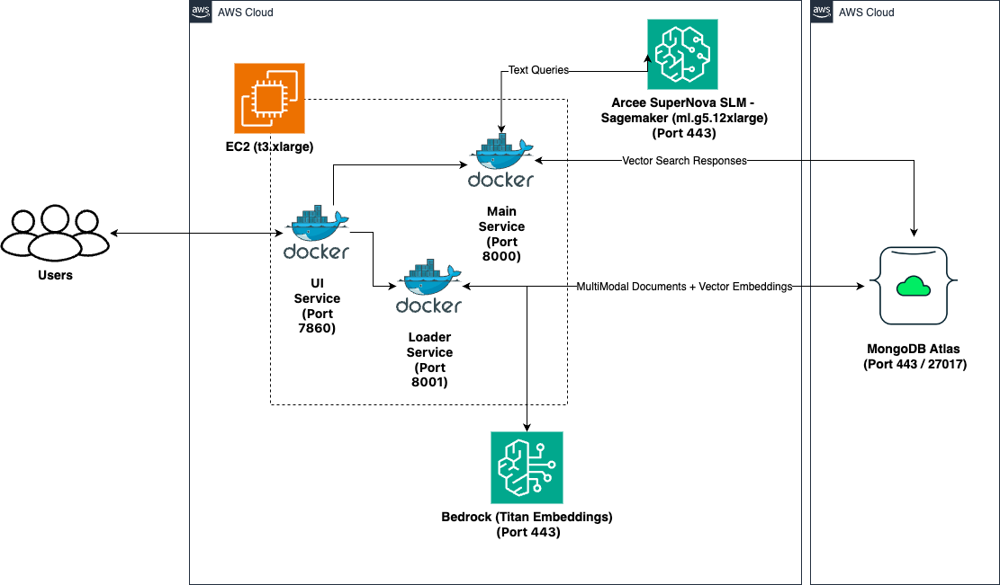

# MongoDB - Arcee Quickstart 

The MongoDB - Arcee Quickstart is a project aimed at facilitating the rapid and straightforward deployment of AI-driven applications utilizing MongoDB Atlas and the Arcee models. It offers scripts and configurations to streamline and automate the setup process, integrating MongoDB Atlas for data storage and Arcee models for AI functionalities.

[](https://github.com/mongodb-partners/maap-arcee-qs)

## Table of Contents
1. [Overview](#1-overview)  
2. [System Architecture](#2-system-architecture)  
3. [Components](#3-components)  
4. [Installation & Deployment](#4-installation--deployment)  
   1. [One-Click Deployment](#41-one-click-deployment)  
5. [Configuration](#5-configuration)  
6. [Usage](#6-usage)  
7. [API Reference](#7-api-reference)  
8. [Security Considerations](#8-security-considerations)  
9. [Monitoring & Logging](#9-monitoring--logging)  
10. [Troubleshooting](#10-troubleshooting)  
11. [Development Guide](#11-development-guide)  
12. [Maintenance & Operations](#12-maintenance--operations)  

## 1. Overview

The MongoDB - Arcee Quickstart is a comprehensive, integrated end-to-end technology stack meticulously designed to facilitate the rapid development and seamless deployment of AI-powered applications. This innovative framework combines the robust capabilities of MongoDB Atlas for scalable data storage and advanced vector search functionalities with the powerful machine learning capabilities of AWS SageMaker and Arcee.ai's state-of-the-art language models. The entire system is encapsulated within a user-friendly interface, enabling effortless interaction and management.

Key features include:
- Advanced vector search capabilities for nuanced, contextual information retrieval
- Seamless integration with AWS SageMaker for efficient AI model inference
- Highly intuitive chat interface for natural language querying and streamlined file uploads
- Scalable microservices architecture designed for optimal performance and resource utilization
- Robust data ingestion and processing pipeline capable of handling diverse data types
- Multi-modal file processing for comprehensive data analysis
- Real-time AI interactions for immediate insights and responses
- Stringent security measures to ensure the integrity and confidentiality of all data handled within the system

This system empowers developers to create sophisticated AI applications that can understand context, process natural language queries, and provide intelligent responses based on ingested data. This makes it an ideal solution for a wide range of applications, from advanced customer support systems and intelligent document analysis tools to complex research assistants and innovative educational platforms.

## 2. System Architecture

This system is built on a robust and flexible microservices architecture, comprising three primary services that work in concert to deliver a seamless AI-powered application experience:

1. **UI Service (Port 7860)**: This service forms the front-end of the MAAP application, providing an intuitive and responsive user interface for interaction. It serves as the primary point of contact for end-users, allowing them to input queries, upload files, and view AI-generated responses.

2. **Main Service (Port 8000)**: Acting as the brain of the system, the Main Service handles the core application logic, manages database queries, and orchestrates AI model interactions. It processes user inputs received from the UI Service, retrieves relevant information from the database, and coordinates with AWS SageMaker for AI model inferences.

3. **Loader Service (Port 8001)**: This service is responsible for managing file uploads and orchestrating the data ingestion process. It handles the complex task of processing various file formats, extracting relevant information, and preparing the data for storage in MongoDB Atlas.

These microservices interact seamlessly with MongoDB Atlas, which serves as the primary data store and provides powerful vector search capabilities. The architecture also integrates with AWS SageMaker, leveraging its scalable infrastructure for AI model hosting and inference.



Data flow within the system:
1. User inputs (text queries or file uploads) are initially received by the UI Service.
2. For document processing, the Loader Service takes over, utilizing AWS Bedrock and the Titan Embeddings model to generate vector representations of the content.
3. These vector embeddings are then stored in MongoDB Atlas, enabling fast and accurate similarity searches.
4. When a query is processed, the Main Service coordinates the retrieval of relevant information from MongoDB Atlas and the generation of appropriate responses.
5. For more complex language understanding and generation tasks, the Main Service interacts with the AI models hosted on AWS SageMaker, specifically leveraging Arcee.ai's advanced language models.

This architecture ensures high scalability, allowing the system to handle increasing loads by scaling individual components as needed. It also provides flexibility, enabling easy updates or replacements of specific services without affecting the entire system.

---

### Document Storage and Segmentation in MongoDB

#### Key Fields in MongoDB
Each document uploaded by a user is stored in MongoDB with the following fields:
- `_id`: MongoDB-generated unique identifier for the document.
- `userId`: Unique identifier for the user (e.g., email address or UUID). This field ensures all documents are segmented and associated with their respective users.
- `document_text`: The full text extracted from the uploaded document.
- `document_embedding`: Vector embeddings generated from the `document_text` for similarity-based searches.
- `link_texts`: Anchor texts of hyperlinks within the document.
- `link_urls`: Corresponding URLs for the hyperlinks.
- `languages`: Detected language(s) of the document content.
- `filetype`: The type of file uploaded (e.g., `text/html`).
- `url`: The source URL of the document (if available).
- `category`: The classification or type of the document (e.g., `CompositeElement`).
- `element_id`: A unique identifier for the specific content element.

#### Data Segmentation by User ID
- The `userId` field is critical for isolating and segmenting data. 
- During queries, only the documents associated with a specific `userId` are retrieved, ensuring data privacy and security.
- This segmentation allows for multi-tenant architecture while maintaining strict user data isolation.

---

### Data Upload Process

#### User Actions
1. **Document Upload**: The user uploads a document through the **UI Service** (running on port 7860).
2. **User Identification**: The system captures the user's unique identifier (`userId`) during the upload process provided in the `User Id` text field on the UI.

#### System Workflow
1. **Content Extraction**:
   - The **Loader Service** (running on port 8001) processes the document, extracting:
     - `document_text`: The full textual content.
     - `link_texts` and `link_urls`: Hyperlinked phrases and their corresponding URLs.
   - Additional metadata is captured, including file type (`filetype`) and detected languages (`languages`).

2. **Embedding Generation**:
   - The **Loader Service** (running on port 8001) also generates vector embeddings from the `document_text` using an embeddings model.
   - These embeddings are used for similarity-based searches.

3. **Data Storage in MongoDB**:
   - All processed data, including `document_text`, `document_embedding`, and metadata, is stored in MongoDB.
   - The data is associated with the `userId` to ensure proper segmentation.

4. **Search Indexing**:
   - The vector embeddings are indexed by MongoDB Atlas Vector Search Index.
   - This indexing allows for efficient similarity searches when querying documents.


## 3. Components

This system is composed of several key components:

### UI Service
- **Purpose**: Provides a web-based interface for user interactions
- **Technologies**: Gradio, Python
- **Interactions**: Communicates with Main Service for query processing and Loader Service for file uploads

### Main Service
- **Purpose**: Handles core application logic, database queries, and AI model interactions
- **Technologies**: FastAPI, LangChain, Python
- **Interactions**: Communicates with MongoDB Atlas for data retrieval and AWS SageMaker for model inference

### Loader Service
- **Purpose**: Manages file uploads and data ingestion into MongoDB Atlas
- **Technologies**: FastAPI, Unstructured, Python
- **Interactions**: Communicates with MongoDB Atlas for data storage

### MongoDB Atlas
- **Purpose**: Provides scalable data storage and vector search capabilities
- **Features**: Vector indexing, multi-collection search

### AWS SageMaker
- **Purpose**: Hosts and serves AI models for inference
- **Features**: Scalable model deployment, API endpoints for prediction

### Core Components
1. **CloudFormation Templates**:
   - `deploy-infra.yaml`: Infrastructure setup
   - `deploy-sagemaker.yaml`: SageMaker deployment
   - `deploy-ec2.yaml`: EC2 instance configuration

2. **Python Services**:
   - MongoDB Atlas integration
   - Vector search implementation
   - Document processing
   - API endpoints

3. **Docker Containers**:
   - Isolated service environments
   - Dependency management
   - Resource allocation

### Technology Stack
- **Backend**: Python 3.10+
- **Database**: MongoDB Atlas
- **ML Platform**: AWS SageMaker
- **API Framework**: FastAPI
- **Frontend**: Gradio
- **Containerization**: Docker
- **Infrastructure**: AWS CloudFormation

## 4. Installation & Deployment

### Prerequisites
- AWS account with appropriate permissions
- MongoDB Atlas account with appropriate permissions
- Python 3.10+
- AWS CLI installed and configured
- SageMaker quota for `ml.g5.12xlarge`
- EC2 quota for `t3.xlarge`
- Programmatic access to your MongoDB Atlas project

### MongoDB Atlas Programmatic Access
To enable programmatic access to your MongoDB Atlas project, follow these steps to create and manage API keys securely:


#### **1. Create an API Key**

1. **Navigate to Project Access Manager:**
   - In the Atlas UI, select your organization and project.
   - Go to **Project Access** under the **Access Manager** menu.

2. **Create API Key:**
   - Click on the **Applications** tab.
   - Select **API Keys**.
   - Click **Create API Key**.
   - Provide a description for the key.
   - Assign appropriate project permissions by selecting roles that align with the principle of least privilege.
   - Click **Next**.

3. **Save API Key Credentials:**
   - Copy and securely store the **Public Key** (username) and **Private Key** (password).
   - **Important:** The private key is displayed only once; ensure it's stored securely.


#### **2. Configure API Access List**

1. **Add Access List Entry:**
   - After creating the API key, add an IP address or CIDR block to the API access list to specify allowed sources for API requests.
   - Click **Add Access List Entry**.
   - Enter the IP address or click **Use Current IP Address** if accessing from the current host.
   - Click **Save**.

2. **Manage Access List:**
   - To modify the access list, navigate to the **API Keys** section.
   - Click the ellipsis (**...**) next to the API key and select **Edit Permissions**.
   - Update the access list as needed.


#### **3. Secure API Key Usage**

- **Environment Variables:** Store API keys in environment variables to prevent hardcoding them in your application's source code.

- **Access Controls:** Limit API key permissions to the minimum required for your application's functionality.

- **Regular Rotation:** Periodically rotate API keys and update your applications to use the new keys to enhance security.

- **Audit Logging:** Monitor API key usage through Atlas's auditing features to detect any unauthorized access.


By following these steps, you can securely grant programmatic access to your MongoDB Atlas project, ensuring that your API keys are managed and utilized in accordance with best practices.

For more detailed information, refer to [Guide](https://www.mongodb.com/docs/atlas/configure-api-access/#grant-programmatic-access-to-a-project).

---

### Minimum System Requirements
- For SageMaker: At least one `ml.g5.12xlarge` instance (or equivalent GPU instance)
- For EC2: At least a `t3.medium` instance (or higher, depending on workload)
- Sufficient EBS storage for EC2 instance (at least 100 GB recommended)
- MongoDB Atlas M10 Cluster (auto-deployed by the `one-click` script)


## 4.1 One-Click Deployment

The `one-click.ksh` Korn shell script automates the deployment of the MongoDB - Arcee Quickstart application on AWS infrastructure. It sets up the necessary AWS resources, deploys an EC2 instance, and configures the application environment.

### Prerequisites

- AWS CLI installed and configured with appropriate credentials
- Access to a MongoDB Atlas account with necessary permissions
- Git SSH key for repository access
- Korn shell (ksh) environment

### Script Structure

The script is organized into several main functions:

1. `create_key()`: Creates or uses an existing EC2 key pair
2. `deploy_infra()`: Deploys the base infrastructure using CloudFormation
3. `deploy_ec2()`: Deploys the EC2 instance and application stack
4. `deploy_sagemaker()`: Deploys the Sagemaker stack
5. `read_logs()`: Streams deployment logs from the EC2 instance
6. Main execution flow

### Configuration

#### Environment Variables

- `AWS_ACCESS_KEY_ID`: AWS access key
- `AWS_SECRET_ACCESS_KEY`: AWS secret key
- `AWS_SESSION_TOKEN`: AWS session token (if using temporary credentials)

#### Deployment Parameters

- `INFRA_STACK_NAME`: Name for the infrastructure CloudFormation stack
- `EC2_STACK_NAME`: Name for the EC2 CloudFormation stack
- `SAGEMAKER_STACK_NAME`: Name for the Sagemaker CloudFormation stack
- `AWS_REGION`: AWS region for deployment
- `EC2_INSTANCE_TYPE`: EC2 instance type (e.g., "t3.xlarge")
- `SAGEMAKER_INSTANCE_TYPE`: Sagemaker instance type (e.g., "ml.g5.12xlarge")
- `VolumeSize`: EBS volume size in GB
- `GIT_REPO_URL`: URL of the application Git repository
- `GIT_SSH_PRIVATE_KEY_PATH`: Path to the Git SSH private key
- `MongoDBClusterName`: Name for the MongoDB Atlas cluster
- `MongoDBUserName`: MongoDB Atlas username
- `MongoDBPassword`: MongoDB Atlas password
- `APIPUBLICKEY`: MongoDB Atlas API public key
- `APIPRIVATEKEY`: MongoDB Atlas API private key
- `GROUPID`: MongoDB Atlas project ID


### Execution Flow

1. Initialize logging
2. Create or use existing EC2 key pair
3. Deploy infrastructure CloudFormation stack
4. Retrieve and store infrastructure stack outputs
5. Deploy EC2 instance and application CloudFormation stack
6. Deploy Sagemaker CloudFormation stack
7. Start streaming EC2 deployment logs
8. Monitor application URL until it becomes available
9. Launch application URL in default browser

### Functions

#### create_key()

Creates a new EC2 key pair or uses an existing one with the name "MAAPArceeKeyV1".

#### deploy_infra()

Deploys the base infrastructure CloudFormation stack, including VPC, subnet, security group, and IAM roles.

#### deploy_ec2()

Deploys the EC2 instance and application stack using a CloudFormation template. It includes the following steps:
- Selects the appropriate AMI ID based on the AWS region
- Creates the CloudFormation stack with necessary parameters
- Waits for stack creation to complete
- Retrieves and displays stack outputs

#### read_logs()

Establishes an SSH connection to the EC2 instance and streams the deployment logs in real-time.

### Logging

- Main deployment logs: `./logs/one-click-deployment.log`
- EC2 live logs: `./logs/ec2-live-logs.log`

### Error Handling

The script includes basic error checking for critical operations such as CloudFormation stack deployments. If an error occurs, the script will log the error and exit.

### Security Considerations

- AWS credentials are expected to be set as environment variables
- SSH key for Git repository access is read from a file and passed securely
- MongoDB Atlas credentials and API keys are passed as CloudFormation parameters

### Customization

To customize the deployment:
1. Modify the CloudFormation template files (`deploy-infra.yaml` and `deploy-ec2.yaml`)
2. Adjust the deployment parameters at the beginning of the script
3. Update the AMI IDs in the `ami_map` if newer AMIs are available

### Troubleshooting

- Check the log files for detailed information on the deployment process
- Ensure all required environment variables and parameters are correctly set
- Verify AWS CLI configuration and permissions
- Check CloudFormation stack events in the AWS Console for detailed error messages

### Limitations

- The script is designed for a specific application stack and may require modifications for other use cases
- It assumes a certain MongoDB Atlas and AWS account setup
- The script does not include rollback mechanisms for partial deployments. In case of partial failures, delete the related CloudFormation stacks from AWS Console.

### Deployment Steps

1. **Configure AWS CLI**:
```bash
aws configure
```

2. **Obtain the deployment files**:

   a. Clone the repository:
   ```bash
   git clone <repository-url>
   cd maap-arcee
   ```
   
   b. Or download the following files from the GitHub repository:
   - `deploy-infra.yaml`
   - `deploy-sagemaker.yaml`
   - `deploy-ec2.yaml`
   - `one-click.ksh`

3. **Configure environment variables**:
   Open the `one-click.ksh` script in a text editor and fill in the required values for various environment variables:
   - AWS Auth: Specify the `AWS_REGION`, `AWS_ACCESS_KEY_ID`, `AWS_SECRET_ACCESS_KEY` for deployment.
   - EC2 & SageMaker Instance Types: Choose suitable instance types for your workload.
   - Network Configuration: Update key names, subnet IDs, security group IDs, etc.
   - Authentication Keys: Fetch Project ID, API public and private keys for MongoDB Atlas Cluster setup. Update the script file with the keys for `APIPUBLICKEY`, `APIPRIVATEKEY`, `GROUPID` suitably.

4. **Deploy the application**:
```bash
chmod +x one-click.ksh
./one-click.ksh
```

This script will create the necessary AWS resources, deploy the SageMaker endpoint, set up and configure the EC2 instance, and install and start the application services.

### Post-Deployment Verification
1. Access the UI service by navigating to `http://<ec2-instance-ip>:7860` in your web browser.
2. Test the system by entering a query and verifying that you receive an appropriate AI-generated response.
3. Try uploading a file to ensure the Loader Service is functioning correctly.
4. Verify that the sample dataset bundled with the script is loaded into your MongoDB Cluster name `MongoDBArceeV1` under the database `travel_agency` and collection `trip_recommendation` by visiting the [MongoDB Atlas Console](https://cloud.mongodb.com).

## 5. Configuration

Key configuration files:
- `.env` files in each service directory
- `docker-compose.yml` for service orchestration
- CloudFormation templates for AWS resource configuration

Important settings:
- MongoDB URI
- AWS credentials and region
- SageMaker endpoint name
- API keys for external services

Note: The `one-click.ksh` script automates the process of setting these values in the appropriate `.env` files.

### Environment Variables
The deployment script creates a `.env` file on the EC2 instance with the following structure:

```env
MONGODB_URI=your_mongodb_connection_string
SAGEMAKER_ENDPOINT_NAME=your_endpoint_name
AWS_REGION=your_aws_region
API_PUBLIC_KEY=your_api_key
API_PRIVATE_KEY=your_private_key
GROUP_ID=your_project_id
```

### Service-Specific Configuration

1. **Main Service**:
   - Model parameters can be adjusted in the `SageMakerLLM.py` file.
   - Vector search settings are configured in `MongoDBAtlasCustomRetriever.py`.

2. **Loader Service**:
   - File processing settings are defined in `loader.py`.
   - Upload configurations are set in `main.py`.

3. **UI Service**:
   - The interface layout and components are configured in `main.py` using Gradio's UI building functions.

### MongoDB Vector Indexes
Ensure that your MongoDB Atlas collection has the appropriate vector index configured:

```javascript
{
  "fields": [
    {
      "numDimensions": 1536,
      "path": "details_embedding",
      "similarity": "cosine",
      "type": "vector"
    }
  ]
}
```

## 6. Usage

1. Access the UI at `http://<ec2-instance-ip>:7860`
2. Enter a user ID and select data sources
3. Type queries or upload files for processing
4. View AI-generated responses based on the context

Example query and response:

```
User: Recommend places to visit in India.
AI: Here are some popular places to visit in India:

1. Taj Mahal, Agra: One of the Seven Wonders of the World, this iconic marble mausoleum is a must-visit.

2. Jaipur, Rajasthan: Known as the "Pink City," it features beautiful palaces and forts like Amber Fort and Hawa Mahal.

3. Varanasi: One of the oldest inhabited cities in the world, known for its spiritual significance and Ganges River ghats.

4. Kerala Backwaters: Enjoy a houseboat cruise through the serene backwaters of Kerala.

5. Goa: Famous for its beaches, Portuguese architecture, and vibrant nightlife.

6. Rishikesh: A spiritual center known for yoga and meditation, located in the foothills of the Himalayas.

7. Udaipur: The "City of Lakes" is known for its romantic setting and beautiful palaces.

8. Delhi: The capital city offers a mix of historical sites like Red Fort and Qutub Minar, as well as modern attractions.

9. Mumbai: India's largest city, known for its bustling urban life, Bollywood, and historical sites like the Gateway of India.

10. Hampi: An ancient village with fascinating ruins of the Vijayanagara Empire.

These destinations offer a diverse range of experiences, from historical and cultural sites to natural beauty and spiritual retreats. Remember to check travel advisories and plan your trip according to the best seasons to visit each location.
```

## 7. API Reference

### Main Service Endpoints
- `/rag`: POST request for RAG (Retrieval-Augmented Generation) queries

### Loader Service Endpoints
- `/upload`: POST request for file uploads and data ingestion

### UI Service
```python
Gradio Interface
URL: http://{EC2PublicIP}:7860
```

### Example Usage
```python
# Query example
curl -X POST "http://localhost:8000/rag" -H "Content-Type: application/json" -d '{"query": "Tell me about India", "userId": "user123"}'
```

## 8. Security Considerations

To enhance the security of your AWS EC2 instances and MongoDB Atlas integration, consider the following configurations and best practices:


### Network and Firewall Configuration

#### **MongoDB Atlas:**
- **IP Access List:**
  - Restrict client connections to your Atlas clusters by configuring IP access lists.
  - Add the public IP addresses of your application environments to the IP access list to permit access.
  - For enhanced security, consider using VPC peering or private endpoints to allow private IP addresses.
  - [Configure IP Access List Entries](https://www.mongodb.com/docs/atlas/security/ip-access-list/).

- **Ports 27015 to 27017 (TCP):**
  - Ensure that your firewall allows outbound connections from your application environment to Atlas on ports **27015 to 27017** for TCP traffic.
  - This configuration enables your applications to access databases hosted on Atlas.


#### **AWS Bedrock and SageMaker:**
- **Port 443 (HTTPS):** Required for API calls and interactions.  
- **Port 2049 (TCP):** Needed for SageMaker EFS usage.  
  - **Security Groups:** Allow outbound traffic on ports 443 and 2049.  
  - **NACLs:** Permit inbound and outbound traffic on these ports.  
---

### Authentication and Authorization

- **Database Users:**
  - Atlas mandates client authentication to access clusters.
  - Create database users with appropriate roles to control access.
  - [Configure Database Users](https://www.mongodb.com/docs/atlas/security/config-db-auth/).

- **Custom Roles:**
  - If default roles don't meet your requirements, define custom roles with specific privileges.
  - [Create Custom Roles](https://www.mongodb.com/docs/atlas/security/config-db-auth/#custom-database-roles).

- **AWS IAM Integration:**
  - Authenticate applications running on AWS services to Atlas clusters using AWS IAM roles.
  - Set up database users to use AWS IAM role ARNs for authentication.
  - [AWS IAM Authentication](https://www.mongodb.com/docs/atlas/security/config-db-auth/#authentication-with-aws-iam).

---

### Data Encryption

- **Encryption at Rest:**
  - Atlas encrypts all data stored on your clusters by default.
  - For enhanced security, consider using your own key management system.
  - [Encryption at Rest](https://www.mongodb.com/docs/atlas/security/encryption-at-rest/).

- **TLS/SSL Encryption:**
  - Atlas requires TLS encryption for client connections and intra-cluster communications.
  - Ensure your applications support TLS 1.2 or higher.
  - [TLS/SSL Configuration](https://www.mongodb.com/docs/atlas/security/tls-ssl/).

---

### Network Peering and Private Endpoints

- **VPC Peering:**
  - Establish VPC peering between your AWS VPC and MongoDB Atlas's VPC to eliminate public internet exposure.
  - [Set Up a Network Peering Connection](https://www.mongodb.com/docs/atlas/security/vpc-peering/).

- **Private Endpoints:**
  - Use AWS PrivateLink to create private endpoints for secure communication within AWS networks.
  - [Configure Private Endpoints](https://www.mongodb.com/docs/atlas/security-cluster-private-endpoint/).

- **NAT Gateway:**
  - Use NAT Gateways to route traffic from private subnets while preventing direct internet access to EC2 instances.  

- **Specific IP Ranges:**
  - AWS services like Bedrock and SageMaker use dynamic IPs. Filter these from [AWS IP Ranges](https://ip-ranges.amazonaws.com/ip-ranges.json) for egress traffic.  


---

### Compliance and Monitoring

- **Audit Logging:**
  - Enable audit logging to monitor database activities and ensure compliance with data protection regulations.
  - [Enable Audit Logging](https://www.mongodb.com/docs/atlas/security/audit-logging/).

- **Regular Updates:**
  - Keep your dependencies and Docker images up to date to address security vulnerabilities.

By implementing these configurations and best practices, you can enhance the security, efficiency, and compliance of your integration between AWS resources and MongoDB Atlas. 

## 9. Monitoring & Logging

- Use AWS CloudWatch for EC2 and SageMaker monitoring
- MongoDB Atlas provides built-in monitoring for database operations
- Application deployment logs are stored in `/home/ubuntu/deployment.log` on the EC2 instance
- Implement centralized logging for all microservices
- The loader service has logs in the `applogs` folder
- Consider logging to MongoDB

### Log Locations
- Application logs: `/home/ubuntu/deployment.log`
- One-click script logs: `./logs/one-click-deployment.log`
- EC2 live logs: `./logs/ec2-live-logs.log`
- Docker logs: Accessible via `docker logs`

### Monitoring Metrics
- CPU/Memory usage
- API response times
- Vector search performance
- Model inference latency

## 10. Troubleshooting

Common issues and solutions:
- Connection errors: Check network configurations and security groups
- Slow responses: Monitor resource utilization and scale as needed
- Data ingestion failures: Verify file formats and MongoDB Atlas connection

### Debug Steps
1. Check logs
2. Verify credentials
3. Confirm resource availability
4. Test network connectivity

## 11. Development Guide

### Code Organization
```
MAAP-Python/
├── main/
│   ├── app/
│   │   ├── server.py
│   │   └── requirements.txt
│   └── Dockerfile
├── loader/
│   ├── main.py
│   └── Dockerfile
├── ui/
│   ├── main.py
│   └── Dockerfile
└── docker-compose.yml
```

### Development Environment
- Use Docker for local development and testing

### Testing Procedures
1. Unit tests for each service
2. Integration tests for API endpoints
3. End-to-end testing with sample data

## 12. Maintenance & Operations

- Regularly update dependencies and runtime environments
- Monitor system performance and scale resources as needed
- Implement backup and disaster recovery procedures for MongoDB Atlas
- Conduct security audits and penetration testing periodically

### Monitoring
- CloudWatch metrics
- MongoDB Atlas monitoring
- Application logs

### Backup Procedures
- MongoDB Atlas backups
- Configuration backups
- Docker image versioning

### Support and Maintenance
For support:
- Slack @ #ask-maap