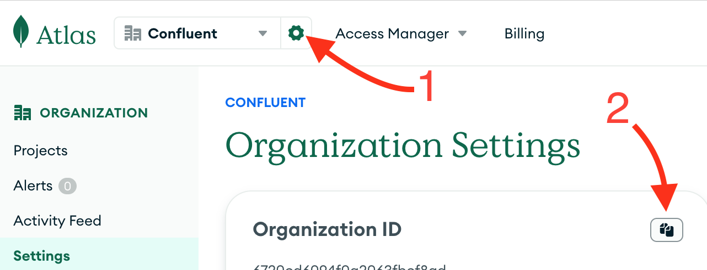

# Healthcare Agent

Welcome to the Medical Knowledge Database Quick Start! This repository offers a step-by-step guide to rapidly deploying 
a fully functional chatbot that helps identify medications, their side effects, dosages, and essential information to 
determine the best treatment for an illness.

The solution leverages **MongoDB**, **Confluent Cloud**, **GCP**, **Gemini** and **Flink** to deliver a scalable, intelligent, 
and real-time conversational experience.

This quick start is designed to help medical professionals efficiently access and manage medication data through an intelligent 
chatbot. The system can answer medical queries, retrieve relevant drug information, and provide actionable insights. 
It also includes structured indexing of medical records into MongoDB's vector database, enabling Retrieval-Augmented Generation (RAG) 
to enhance the chatbot's accuracy and reliability.

[](https://github.com/mongodb-partners/maap-confluent-gcp-qs)


## Key Features

* **Real-Time Data Processing**: Powered by Confluent Cloud and Flink, ensuring low-latency communication and
  event-driven architecture.
* **Intelligent Conversations**: Integrated with Gemini's AI models for natural and accurate conversational
  responses.
* **Efficient Document Retrieval**: Leverages MongoDB Atlas with vector search capabilities for quick and accurate
  document indexing and retrieval.
* **Scalable and Cloud-Native**: Built with Google Cloud Functions to provide a flexible and serverless REST API.
* **Seamless Deployment**: Follow step-by-step instructions to deploy the entire solution with minimal effort.

## Use Case

This chatbot is designed for medical professionals to:  

* Provide instant responses to queries about prescription drugs, including dosages, side effects, and contraindications.  
* Retrieve structured drug information based on symptoms, illness names, or treatment categories.  
* Automate access to a comprehensive medication database, enabling faster and more informed decision-making.  

Whether you're looking to streamline drug research, enhance clinical decision support, or explore AI-powered medical 
information retrieval, this quick start provides a strong foundation.  

👉 This quick start sets up a functional AI-driven prescription drug database but operates on a limited set of sample 
data. The information provided should not be treated as medical fact or used for real-world diagnosis or treatment 
decisions. Always consult trusted medical sources or healthcare professionals for accurate and up-to-date drug information. 

Refer to the **Next Steps** section at the end of this document to learn how you can refine the architecture and improve AI performance.

## Table of Contents

- [GenAI Chatbot Quickstart](#genai-chatbot-quickstart)
    - [Key Features](#key-features)
    - [Use Case](#use-case)
    - [Table of Contents](#table-of-contents)
    - [Architecture](#architecture)
        - [Document Indexing](#document-indexing)
        - [Chatbot](#chatbot)
        - [Key Concepts](#key-concepts)
    - [Requirements](#requirements)
        - [Docker](#docker)
        - [Access Keys to Cloud Services Providers](#access-keys-to-cloud-services-providers)
            - [Confluent Cloud](#confluent-cloud)
            - [MongoDB Atlas](#mongodb-atlas)
            - [GCP](#GCP)
                - [Enable Foundation Model Access](#enable-foundation-model-access)
    - [Run the Quickstart](#run-the-quickstart)
        - [1. Bring up the infrastructure](#1-bring-up-the-infrastructure)
        - [2. Have a conversation](#2-have-a-conversation)
            - [2b. Add a new product (Optional)](#2b-add-a-new-product-optional)
        - [3. Bring down the infrastructure](#3-bring-down-the-infrastructure)

## Architecture


Architecture for handling document indexing and chatbot functionality using a combination of GCP services, Gemini
Vertex, MongoDB Atlas and Confluent Cloud. Below is a breakdown of the architecture and its components:

### Document Indexing

This section focuses on ingesting and processing data for use in downstream applications like search and chatbots.

1. **Data Sources:** Various data sources feed into the system. These could be structured or unstructured data streams.
2. **Summarisation:** Google Gemini is used to summarise data, extracting meaningful information from documents.
3. **Vectorisation:** Embeddings are generated for the input data to convert textual information into high-dimensional
   numerical vectors.
4. **Sink Connector:** Processed data (both summarised content and embeddings) is output via a sink connector to MongoDB
   Atlas vector database.

### Chatbot

This section demonstrates how the system interacts with user queries in real time.

1. **Frontend:** The frontend handles interactions with users. User inputs are sent to a topic for further processing.
2. **Websocket:** Provides real-time communication between the frontend and backend for immediate responses.
3. **Query Vectorisation:** User queries are vectorised using the Embeddings model to transform them into numerical
   representations. This is done to match queries against stored vectors in the vector search database.
4. **Vector Search:** MongoDB Atlas vector database, retrieves relevant information based on the vectorised query. It
   searches through embeddings generated during the document indexing phase.
5. **Model Inference:** Google Gemini is used for model inference to generate responses.
6. **Output to User:** The system sends the processed results back to the user via the websocket.

### Key Concepts

1. **Embeddings:** These are vector representations of text, allowing the system to handle semantic search.

2. **MongoDB Atlas:** Enables efficient, scalable, and real-time semantic matching of user queries against
   high-dimensional embeddings to deliver relevant results in the chatbot and document indexing workflows.

3. **Google Gemini:** Used for both summarisation and generating responses in natural language.

## Requirements

### Docker

The `deploy`script builds everything for you, the only required software is Docker.

Follow the [Get Docker](https://docs.docker.com/get-docker/) instructions to install it on your computer.

### Access Keys to Cloud Services Providers

Once you have `docker` installed, you just need to get keys to authenticate to the various CSPs.

#### Confluent Cloud


For Confluent Cloud, you need to get a *Cloud resource management* key.

If you don't already have an account, after signing up, click the top right corner menu (AKA the hamburger menu) and
select *API keys*.


Click the *+ Add API key* button, select *My Account* and click the *Next* button (bottom right).
If you feel like it, enter a name and description. Click the *Create API Key* (bottom right).

#### MongoDB Atlas


1. Connect to the Atlas UI. You must have Organisation Owner access to Atlas.
2. Select *Organisation Access* from the *Access Manager* menu in the navigation bar.
3. Click *Access Manager* in the sidebar. (The Organisation Access Manager page displays.)
4. Click *Add new* then *API Key*
5. In the *API Key Information*, enter a description.
6. In the *Organisation Permissions* menu, select the *Organisation Owner* role. **Important:** Make sure that only the
   *Organisation Owner* role is selected, you may have to click the default *Organisation Member* to un-select it.
7. Click *Next*, copy the public and private key in a safe place and click *Done*.

Useful links:

* [Grant Programmatic Access to an Organisation](https://www.mongodb.com/docs/atlas/configure-api-access/#grant-programmatic-access-to-an-organization)
* [MongoDB Atlas API Keys](https://www.mongodb.com/developer/products/atlas/mongodb-atlas-with-terraform/) (part of a
  tutorial on Terraform with Atlas)

At last, get your Atlas Organisation ID from the Atlas UI.



#### GCP

To use Google Gemini within your chatbot, you need to obtain a Gemini API Key and your Google Cloud Project ID. 
Follow the steps below to set up your credentials properly.

* **Retrieve Your Google Cloud Project ID**:  If you don’t have a Google Cloud account yet, sign up at [Google Cloud](https://cloud.google.com/). 
Once signed in, go to the Google Cloud Console, where you'll find your Project ID displayed beneath your project
name on the Welcome screen. Save this Project ID, as you’ll need it later during deployment.
* **Generate a Gemini API Key**: In the Google Cloud Console, open the navigation menu (☰) in the top-left corner 
and go to APIs & Services → Credentials. Click + Create Credentials, then select API Key from the dropdown menu. 
Your API key will be generated—copy and store it securely, copy and securely store this key, as it will be required during deployment.
* **Use Your API Key During Deployment**: When running the deployment script (deploy.sh), the application will prompt you to enter the Gemini API Key.
Provide the API key you saved in the previous step.

By completing these steps, your Google Cloud environment will be configured for the chatbot to integrate with the Gemini API.

> [!IMPORTANT]  
> Please be sure to select **Don't Restrict Key** under your Gemini API Key as you can see below.


If not enabled yet please navigate to the **+Enable APIs and Services** tab to enable APIs below.
- Artifact Registry API
- Cloud Build API
- Cloud Run Admin API
- Cloud Logging API
- BigQuery API
- Compute Engine API
- Identity and Access Management (IAM) API
- Cloud Pub/Sub API

Google Cloud credentials are required for Flink AI to connect to Vertex AI, as well as for deploying resources using 
Terraform. You will need a service account key with appropriate IAM permissions.

###### Managed Policies

If you are using managed policies in Google Cloud, assign the following IAM roles to your service account or user:

SERVICE ACCOUNTS

---

**Useful links:**


* [Flink AI: Create Model](https://docs.confluent.io/cloud/current/ai/ai-model-inference.html#create-an-ai-model)
* [Google AI from Flink AI](https://docs.confluent.io/cloud/current/ai/ai-model-inference.html#google-ai)

---
# Run the Quickstart

### Regional Deployment Considerations

When deploying this solution, ensure that all cloud services—**Confluent Cloud**, **fully managed source and sink connectors**, 
**MongoDB Atlas**, **Google Cloud (Vertex AI & Gemini models)**, and **Confluent Flink** — are deployed in regions that can 
communicate with each other to avoid network latency or connectivity issues. Each provider has specific guidelines for 
cross-region communication and networking:

- **Confluent Cloud Region Compatibility**: [Check supported regions](https://docs.confluent.io/cloud/current/clusters/regions.html)  
- **Fully Managed Connectors Regions**: [Connector availability by region](https://docs.confluent.io/cloud/current/connectors/index.html)  
- **MongoDB Atlas Multi-Region Setup**: [Atlas cloud provider regions](https://www.mongodb.com/docs/atlas/reference/google-gcp/#std-label-google-gcp)  
- **Google Cloud Region Selection**: [GCP supported regions](https://cloud.google.com/about/locations)  
- **Confluent Flink Regions & Deployment**: [Confluent Flink docs](https://docs.confluent.io/cloud/current/flink/reference/cloud-regions.html#flink-cloud-regions)  


### 1. Bring up the infrastructure

```
# Follow the prompts to enter your API keys
./deploy.sh
```

### 2. Have a conversation

Once the infrastructure is up and running, you can interact with the chatbot by opening the cloudfront url generated by
terraform.

For example, if the terraform output is:

```sh
...
frontend_url = "https://quickstart-gcp-mongo-xkwzufwj-664304379300.us-central1.run.app"
...
```

You may have the following conversation


For the purposes of this quickstart, any username and password will be accepted, and you'll need to open the chat bubble
on the bottom right (after you log in) to have a conversation. Consider questions like; `I have a headache, whats the best medicine?`


### 3. Bring down the infrastructure

```
./destroy.sh
```
## FAQ
### When I run destroy.sh I encounter **gcp reauth needed** error. How can I solve this problem?
The credentials associated with the session have expired due to a timeout.
Reauthentication is not enabled while you have an existing **.config** file.
Try deleting both **.config** files under `root` and `/services` directory.

### Which deploy.sh and destroy.sh should I run?
When deploying and destroying the project please run the root directory script files.


### Is there a shortcut to pass environment variables once instead providing them every time I deploy?
Yes, after your first deploy you can find all of them under your .env file. Be sure to export these variables before your next deploy.

### I am hitting "Error: error reading Kafka Topic: 401 API-key based authentication failed.: API-key based authentication failed." error while rotating my keys. How can I fix this?
Kindly check if this is a key propagation issue and if the enough time has passed after creation. Check if all permissions, ACLs, etc are correctly set.
If everything looks in place then most probably the revoked API values were cached in the credentials section of the terraform resource confluent_kafka_topic.
A `terraform apply -refresh=false` under `/infrastructure` directory should correct the issue.

### Do I need to provide credit card information when I create an account at Google Cloud Platform and Confluent Cloud?
Yes, please provide your credit card information if you do not already have an account at GCP or Confluent Cloud and need to create one for this quickstart.


## Next Steps - Improving the Results

There are several ways to enhance the chatbot's accuracy and relevance in retrieving medical information:

**Expand the Medical Knowledge Database**: The current demo operates on a limited set of sample prescription drugs data. 
You can increase the dataset size by incorporating more drug references, side effect reports, and clinical guidelines.
The dataset can be updated in `infrastructure/modules/data/medication.avro`.

**Refine AI Prompts for Medical Queries**: The chatbot’s responses are influenced by the prompts used for query processing. 
You can fine-tune these prompts in:

* infrastructure/statements/insert/chat-input-query.sql
* infrastructure/statements/insert/populate-chat-output.sql 

Adjusting these prompts can improve the specificity and accuracy of AI-generated medical insights.

**Optimise Vectorisation and Search in MongoDB Atlas**: Since the chatbot relies on MongoDB Atlas' vector search for 
retrieving relevant medical documents, you can enhance search efficiency by adjusting indexing strategies. 
The configuration can be updated in `infrastructure/main.tf`, under resource "mongodbatlas_search_index" "search-vector" 
For further optimisations, refer to:
[Atlas Vector Search Index Fields](https://www.mongodb.com/docs/atlas/atlas-vector-search/vector-search-type/#atlas-vector-search-index-fields)
[Vector Search Queries](https://www.mongodb.com/docs/atlas/atlas-vector-search/vector-search-stage/)

**Fine-Tune Google Gemini for Better Summarisation and Responses**: Google Gemini is responsible for both summarising medical data and generating conversational responses.
You can tweak the temperature parameter in infrastructure/statements/create-models/gcp-vertexai-embed.sql to control response variability—lower values lead to more deterministic, fact-based answers, while higher values encourage creative phrasing.
Refer to the Google Gemini documentation for detailed tuning options.

By iterating on these improvements, you can enhance the chatbot’s reliability, making it a more powerful tool for medical professionals seeking accurate, real-time medication insights.