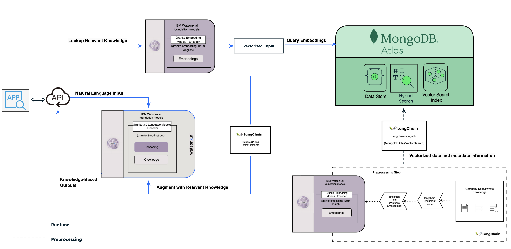

# MongoDB - IBM Quickstart

Welcome to the MongoDB - IBM Quickstart, we will be using a financial dataset containing customer details, transactions, spending insights, and metadata, which we are storing in **MongoDB Atlas**, a fully managed cloud database platform. These records represent real-world scenarios such as payments, savings, and expenses, making the dataset highly relevant for building an intelligent finance assistant. To generate the vector embeddings for storing and retrieving this data, we will use the **Granite Embedding Models (ibm-granite/granite-embedding-125m-english)** from **IBM Watsonx.ai**. These embeddings capture the semantic meaning of financial data, enabling efficient similarity searches and contextual data retrieval. In addition to embedding models, Watsonx.ai also provides large language models (LLMs) for conversational chat query and retrieval capabilities, in our use case we are using **Granite 3.0 (ibm/granite-3-8b-instruct) model**, which are integral to this tutorial. By the end of this tutorial, you’ll have a functional system ready to support real-time financial assistance and personalized recommendations.


[](https://github.com/mongodb/mdb-ibm)
---


## Architecture Overview
The architecture of the Finance Assistant integrates MongoDB Atlas’s advanced vector search capabilities with IBM Watsonx.ai’s reasoning and language generation models. The system provides an end-to-end pipeline for handling user queries, from natural language understanding to intelligent data retrieval and response generation.



### The Flow of the Architecture
1. **Preprocessing:**
- Financial data, such as customer transactions or private knowledge bases, is vectorized using IBM [Watsonx.ai](http://watsonx.ai/) embedding models.
- Vector embeddings are stored in MongoDB Atlas alongside metadata.
2. **Query Execution:**
- User input is processed into embeddings and matched against MongoDB Atlas’s Vector Search Index.
- Relevant data is retrieved and passed to IBM [Watsonx.ai](http://watsonx.ai/) for contextual reasoning.
3. **Response Generation:**
- [Watsonx.ai](http://watsonx.ai/) generates intelligent, explainable recommendations based on the retrieved data.
- The response is delivered to the user in natural language.


## Features
1. **Login Page**: 
   - User authentication interface for customers.
   - Minimalistic and responsive design.

2. **Chatbot Interface**: 
   - Interactive FAQ assistant powered by **MongoDB Atlas** and **IBM Watsonx**.
   - Chatbot widget for real-time banking assistance.
   - Also, after login we have chatbot for personalized banking assistance.

3. **Backend Processing**:
   - Data preprocessing script (`preprocessing.py`) to clean and prepare data.
   - Core logic processing script (`processing.py`) to manage requests and responses.

## Files

### 1. `login.html`
- A responsive login page with a clean design.
- Accepts **Customer ID** for authentication.
- Includes an integrated chatbot widget for quick FAQs assistance.

### 2. `chatbot.html`
- A full-fledged chatbot interface with a sleek design.
- Includes welcome messages, logout functionality, and real-time interaction.
- Backend integration for fetching data via APIs.

### 3. `preprocessing.py`
- Prepares and cleans the data to ensure efficient processing.
- Key tasks: Data normalization, handling missing values, and optimization for MongoDB.

### 4. `processing.py`
- Implements the core chatbot logic.
- Handles API calls, processes user queries, and fetches responses from the database or AI model.

---

## Setup Instructions

### Prerequisites
Before starting the implementation, ensure you have the following set up:
- **Python 3.11+**
- **MongoDB Atlas: Cluster with Transaction and Customer Data Collections**,
MongoDB Atlas will be the primary database for storing and querying transaction and customer data.

1. Create a MongoDB Atlas Account

   *    Visit MongoDB Atlas and click “Start Free”.
   *    Sign up using your email, or log in with Google, GitHub, or Microsoft.

2. Set Up a Cluster

   * Click “Build a Cluster” after logging in.
   * Choose a free tier cluster or upgrade for more features.
   * Select your cloud provider (AWS, Google Cloud, or Azure) and region.
   * Click “Create Cluster” to deploy (this may take a few minutes).

3. Configure Your Cluster

   * Go to “Database Access” and create a user with a username, password, and role (e.g., “Read and Write to Any Database”).
   * In “Network Access”, add your IP address or allow all IPs (0.0.0.0/0) for unrestricted development access.

- **IBM Watsonx.ai: API Key for Accessing LLMs**, 
IBM Watsonx.ai will handle the reasoning and generative tasks.

1. Create an IBM Cloud Account
   * Visit IBM Cloud and sign up for a free account.

2. Set Up Watsonx.ai
   * Log in and search for “Watsonx.ai” in the catalog.
   * Create an instance; a sandbox environment will be set up automatically.
   * You can locate project id under IBM Watsonx sandbox account.


3. Generate an API Key on IBM Cloud
   * Go to “Manage” > “Access (IAM)” in the IBM Cloud dashboard.
   * Click “Create API Key”, name it (e.g., watsonx_key), and save it securely.


4. Retrieve Service URL
   * Find the service URL (e.g., https://us-south.ml.cloud.ibm.com) in the Watsonx.ai instance dashboard.


### Steps to run repository code
1. Clone the repository:
   ```bash
   git clone https://github.com/your-repo-url.git
   cd your-repo-directory
   ```

2. Install dependencies:
   ```bash
   pip install -r requirements.txt
   ```

3. Run the preprocessing script to prepare data:
   ```bash
   python preprocessing.py
   ```

4. Start the application backend:
   ```bash
   python processing.py
   ```

5. Serve the frontend:
   - Use a web server like Flask, Django, or any static file server to host the HTML files.

---

## Usage
1. Open `<hosted-ip:5000/login>` in a web browser.
2. Engage with the chatbot on the login page, which provides information on general FAQs. Sample questions are also included within the chatbot dialogue.
3. Select a Customer ID from the dropdown, choose any ID, and proceed with login.
4. Interact with the chatbot for banking assistance.

---

## Screenshots


---

## Customizability
The reference code provided in this repository is designed to give you a jumpstart for implementing the reference architecture. It can be customized to meet specific use case requirements, such as integrating additional AI models, altering the frontend design, or modifying backend workflows to handle specific business logic.
### IBM Foundation Models
By providing a vast variety of foundation models and robust customization options, IBM Watsonx.ai empowers developers to explore and implement solutions tailored to their unique needs. Explore the models here: [IBM Watsonx.ai Foundation Models](https://www.ibm.com/products/watsonx-ai/foundation-models).

### Understanding Model Parameters
IBM Watsonx.ai allows for extensive customization of model behavior through adjustable parameters. These parameters impact how the models generate responses, enabling fine-tuning for specific use cases.

A detailed guide on available parameters and their usage can be found here: [Watsonx.ai Model Parameters](https://dataplatform.cloud.ibm.com/docs/content/wsj/analyze-data/fm-model-parameters.html?context=wx). Examples include:
1. **temperature**: Controls randomness in responses.
2. **max_tokens**: Limits the response length.
3. **top_p**: Enables nucleus sampling for better result diversity.

Developers are encouraged to review this guide and adjust parameters as needed to optimize model performance.

---

## Technologies Used
- **Frontend**: HTML, CSS, JavaScript
- **Backend**: Python, MongoDB
- **APIs**: IBM Watsonx.ai
- **Database**: MongoDB Atlas
