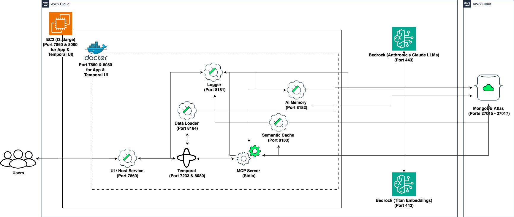

# Temporal

The MongoDB - Temporal Quickstart is an integrated end-to-end AI application framework that combines MongoDB Atlas, Amazon Bedrock, and Temporal Workflow technology. The system provides a conversational AI interface with advanced memory capabilities, semantic caching, and robust document processing abilities.

[](https://github.com/mongodb-partners/maap-temporal-qs)

## Table of Contents

1. [System Overview](#1-system-overview)
2. [Architecture](#2-architecture)
   - [2.1 Core Components](#21-core-components)
   - [2.2 Integration Points](#22-integration-points)
3. [Services in Detail](#3-services-in-detail)
   - [3.1 Host Service](#31-host-service)
   - [3.2 AI Memory Service](#32-ai-memory-service)
   - [3.3 Semantic Cache Service](#33-semantic-cache-service)
   - [3.4 Data Loader Service](#34-data-loader-service)
   - [3.5 Event Logger Service](#35-event-logger-service)
4. [Workflows](#4-workflows)
   - [4.1 Image Processing Workflow](#41-image-processing-workflow)
   - [4.2 Semantic Cache Workflow](#42-semantic-cache-workflow)
   - [4.3 Memory Retrieval Workflow](#43-memory-retrieval-workflow)
   - [4.4 AI Generation Workflow](#44-ai-generation-workflow)
   - [4.5 Data Ingestion Workflow](#45-data-ingestion-workflow)
5. [MCP (Model Context Protocol)](#5-mcp-model-context-protocol)
6. [MongoDB Integration](#6-mongodb-integration)
   - [6.1 Collections and Indexes](#61-collections-and-indexes)
   - [6.2 Vector Search](#62-vector-search)
7. [Installation & Deployment](#7-installation--deployment)
   - [7.1 Environment Setup](#71-environment-setup)
   - [7.2 Configuration Files](#72-configuration-files)
   - [7.3 Deployment Scripts](#73-deployment-scripts)
   - [Prerequisites](#prerequisites)
   - [MongoDB Atlas Programmatic Access](#mongodb-atlas-programmatic-access)
   - [Minimum System Requirements](#minimum-system-requirements)
   - [One-Click Deployment](#one-click-deployment)
   - [Manual Deployment](#manual-deployment)
8. [API Reference](#8-api-reference)
9. [Usage Flow](#9-usage-flow)
10. [Error Handling and Logging](#10-error-handling-and-logging)
11. [Security Considerations](#11-security-considerations)
    - [Network and Firewall Configuration](#network-and-firewall-configuration)
    - [Authentication and Authorization](#authentication-and-authorization)
    - [Data Encryption](#data-encryption)
    - [Network Peering and Private Endpoints](#network-peering-and-private-endpoints)
    - [Compliance and Monitoring](#compliance-and-monitoring)
12. [Monitoring & Logging](#12-monitoring--logging)
13. [Troubleshooting](#13-troubleshooting)
14. [Scalability Considerations](#14-scalability-considerations)
15. [Development Guide](#15-development-guide)
16. [Maintenance & Operations](#16-maintenance--operations)
17. [Conclusion](#conclusion)

## 1. System Overview

The architecture features multiple microservices communicating through a Temporal workflow orchestration layer, which ensures reliability, fault tolerance, and scalability. The system leverages MongoDB Atlas for vector database capabilities, Amazon Bedrock for AI services (embeddings and LLMs), and Temporal for workflow orchestration.

Key features include:

- Vectorized document storage and retrieval using MongoDB Atlas
- Hybrid search combining vector similarity and keyword matching
- AI-powered conversation and memory management
- Workflow orchestration using Temporal
- Integration with AWS Bedrock for AI model inference
- Semantic caching for improved response times
- AI-augmented memory for contextual responses
- Data loading and processing from various sources
- Image processing capabilities
- Event logging and monitoring
- Scalable and maintainable microservices architecture

## 2. Architecture

The system architecture diagram for MongoDB - Temporal Quickstart:



The diagram illustrates the MongoDB - Temporal system architecture with:

1. **User Interface**: The entry point for user interactions
2. **FastAPI/Gradio Application**: The web application layer providing the UI and API endpoints
3. **Temporal Workflow Engine**: Orchestrates workflows and activities
4. **MCP Clients Manager**: Central manager for Model Context Protocol clients
5. **Service Components**:
   - MongoDB Service: Handles database operations
   - Bedrock Service: Manages AI model interactions
   - AI Memory Service: Provides conversation history and memory functions
   - Semantic Cache Service: Caches AI responses for similar queries
   - Data Loader Service: Ingests documents and web content
   - Event Logger Service: Centralized logging
   - Image Processing: Handles image uploads and processing
6. **External Systems**:
   - MongoDB Atlas: Vector database for data storage
   - AWS Bedrock: AI models for embeddings and text generation
7. **Logging Service**: Central logging facility for application monitoring

### 2.1 Core Components

The system consists of the following microservices:

1. **Host Service**: The central coordinator that manages the UI and workflow orchestration (Port 7860)
2. **AI Memory Service**: Provides conversation history and memory functions (Port 8182)
3. **Semantic Cache Service**: Caches AI responses for similar queries (Port 8183)
4. **Data Loader Service**: Ingests and processes documents and web content (Port 8184)
5. **Event Logger Service**: Centralized logging service (Port 8181)
6. **Temporal Service**: Workflow orchestration and execution (Port 7233 & 8080)

### 2.2 Integration Points

- **MongoDB Atlas**: Vector database for storing embeddings, documents, and conversational data (Ports 27015 to 27017 (TCP))
- **Amazon Bedrock**: Provides AI capabilities through Claude and Titan models (Port 443)
- **Temporal**: Workflow orchestration system for reliable workflow execution (Port 7233 & 8080)
- **Docker & Containers**: All services are containerized for deployment

## 3. Services in Detail

### 3.1 Host Service

The Host Service serves as the central coordinator and provides:

- User interface via Gradio
- Temporal workflow client
- MCP (Model Context Protocol) server for tool integration
- Workflow definitions and activity implementations

**Key Files:**

- `host/ui_app.py`: Main UI application
- `host/temporal_client.py`: Temporal client interface
- `host/workflows.py`: Workflow definitions
- `host/activities.py`: Activity implementations
- `host/temporal_worker.py`: Temporal worker implementation
- `host/maap_mcp/`: MCP server implementation

### 3.2 AI Memory Service

The AI Memory Service manages conversation history and memory, featuring:

- Long-term memory capabilities for AI
- Hierarchical memory with importance-based retrieval
- Vector-based similarity search for relevant memories
- Conversation summarization

**Key Files:**

- `ai-memory/main.py`: API endpoints
- `ai-memory/services/memory_service.py`: Memory management functions
- `ai-memory/services/conversation_service.py`: Conversation handling
- `ai-memory/services/bedrock_service.py`: AI model integration

### 3.3 Semantic Cache Service

The Semantic Cache Service provides:

- Vector-based caching of AI responses
- Similarity-based retrieval of cached responses
- TTL-based cache expiration
- User-specific cache entries

**Key Files:**
- `semantic-cache/main.py`: API endpoints
- `semantic-cache/services/cache_service.py`: Cache operations
- `semantic-cache/services/bedrock_service.py`: Embedding generation
- `semantic-cache/database/mongodb.py`: MongoDB integration

### 3.4 Data Loader Service

The Data Loader Service provides document ingestion and processing:
- File upload and processing
- Web page content extraction
- Document chunking and embedding
- MongoDB vector storage integration

**Key Files:**
- `data-loader/main.py`: API endpoints
- `data-loader/services/document_service.py`: Document processing
- `data-loader/services/embedding_service.py`: Vector embedding generation
- `data-loader/utils/file_utils.py`: File handling utilities

### 3.5 Event Logger Service

The Event Logger Service offers:
- Centralized logging for all services
- Structured logging with context
- MongoDB persistence of logs
- Real-time and async log processing

**Key Files:**
- `event-logger/main.py`: API endpoints
- `event-logger/logger.py`: Logger implementation
- `event-logger/models/pydantic_models.py`: Log data models

## 4. Workflows

The system uses Temporal workflows to coordinate complex operations reliably. Key workflows include:

### 4.1 Image Processing Workflow

Handles image uploads and prepares them for AI model consumption.
```python
@workflow.defn
class ImageProcessingWorkflow:
    @workflow.run
    async def run(self, params: ImageProcessingParams) -> ImageProcessingResult:
        # Process image and return result
```

### 4.2 Semantic Cache Workflow

Checks if a semantically similar query exists in the cache.
```python
@workflow.defn
class SemanticCacheCheckWorkflow:
    @workflow.run
    async def run(self, params: SemanticCacheParams) -> Dict[str, Any]:
        # Check cache for similar queries
```

### 4.3 Memory Retrieval Workflow

Retrieves relevant memories for the current conversation.
```python
@workflow.defn
class MemoryRetrievalWorkflow:
    @workflow.run
    async def run(self, params: MemoryRetrievalParams) -> Dict[str, Any]:
        # Retrieve relevant memories
```

### 4.4 AI Generation Workflow

Generates AI responses using Amazon Bedrock.
```python
@workflow.defn
class AIGenerationWorkflow:
    @workflow.run
    async def run(self, params: AIGenerationParams) -> Any:
        # Generate AI response using Bedrock
```

### 4.5 Data Ingestion Workflow

Processes and stores documents in the vector database.
```python
@workflow.defn
class DataIngestionWorkflow:
    @workflow.run
    async def run(self, params: DataIngestionParams) -> Dict[str, Any]:
        # Process and store documents
```

## 5. MCP (Model Context Protocol)

The system uses a Model Context Protocol implementation for tool integration with the AI model. Key features:
- Tool registration and discovery
- Tool execution with error handling
- Prompt template management
- Resource access

**Available Tools:**
- `hybrid_search`: Vector-based document search
- `store_memory`: Store conversation messages
- `retrieve_memory`: Get relevant conversation context
- `semantic_cache_response`: Cache AI responses
- `check_semantic_cache`: Check for cached responses
- `search_web`: Web search using Tavily API

## 6. MongoDB Integration

### 6.1 Collections and Indexes

The system uses several MongoDB collections:
- **documents**: Stores processed documents with vector embeddings
- **conversations**: Stores conversation messages with timestamps
- **memory_nodes**: Stores hierarchical memory nodes
- **cache**: Stores semantic cache entries
- **logs**: Stores application logs

Vector search indexes are created for similarity-based queries.

### 6.2 Vector Search

The system uses MongoDB Atlas Vector Search for similarity queries with indexes on:
- Document embeddings
- Memory embeddings
- Conversation embeddings
- Cache entry embeddings

## 7. Installation & Deployment

### 7.1 Environment Setup

The system requires:
- MongoDB Atlas cluster
- AWS credentials for Bedrock access
- Docker and Docker Compose

### 7.2 Configuration Files

Each service has its own `.env` file for configuration:
- **MongoDB Configuration**:
  - `MONGODB_URI`: Connection string
  - `DB_NAME`: Database name
- **AWS Configuration**:
  - `AWS_REGION`: AWS region
  - `AWS_ACCESS_KEY_ID`: Access key
  - `AWS_SECRET_ACCESS_KEY`: Secret key
  - `EMBEDDING_MODEL_ID`: Model for embeddings
  - `LLM_MODEL_ID`: Model for text generation
- **Service Configuration**:
  - `SERVICE_HOST`: Host address
  - `SERVICE_PORT`: Port number
  - `LOGGER_SERVICE_URL`: URL for logging service

### 7.3 Deployment Scripts

The system provides several scripts for deployment:
- `build-push-images-to-ecr.ksh`: Build and push container images to Amazon ECR
- `mongodb_cluster_manager.ksh`: Manage MongoDB Atlas clusters
- `one-click.ksh`: One-click deployment using CloudFormation
- `build-images.ksh`: Build Docker images locally
- `docker-compose.yml`: Docker Compose configuration

### Prerequisites

- AWS account with appropriate permissions
- MongoDB Atlas account with appropriate permissions
- Python 3.10+
- Docker and Docker Compose installed
- AWS CLI installed and configured
- EC2 quota for `t3.xlarge`
- Programmatic access to your MongoDB Atlas project

### MongoDB Atlas Programmatic Access

To enable programmatic access to your MongoDB Atlas project, follow these steps to create and manage API keys securely:

#### **1. Create an API Key**
1. **Navigate to Project Access Manager:**
   - In the Atlas UI, select your organization and project.
   - Go to **Project Access** under the **Access Manager** menu.
2. **Create API Key:**
   - Click on the **Applications** tab.
   - Select **API Keys**.
   - Click **Create API Key**.
   - Provide a description for the key.
   - Assign appropriate project permissions by selecting roles that align with the principle of least privilege.
   - Click **Next**.
3. **Save API Key Credentials:**
   - Copy and securely store the **Public Key** (username) and **Private Key** (password).
   - **Important:** The private key is displayed only once; ensure it's stored securely.

#### **2. Configure API Access List**
1. **Add Access List Entry:**
   - After creating the API key, add an IP address or CIDR block to the API access list to specify allowed sources for API requests.
   - Click **Add Access List Entry**.
   - Enter the IP address or click **Use Current IP Address** if accessing from the current host.
   - Click **Save**.
2. **Manage Access List:**
   - To modify the access list, navigate to the **API Keys** section.
   - Click the ellipsis (**...**) next to the API key and select **Edit Permissions**.
   - Update the access list as needed.

#### **3. Secure API Key Usage**
- **Environment Variables:** Store API keys in environment variables to prevent hardcoding them in your application's source code.
- **Access Controls:** Limit API key permissions to the minimum required for your application's functionality.
- **Regular Rotation:** Periodically rotate API keys and update your applications to use the new keys to enhance security.
- **Audit Logging:** Monitor API key usage through Atlas's auditing features to detect any unauthorized access.

By following these steps, you can securely grant programmatic access to your MongoDB Atlas project, ensuring that your API keys are managed and utilized in accordance with best practices.
For more detailed information, refer to [Guide](https://www.mongodb.com/docs/atlas/configure-api-access/#grant-programmatic-access-to-a-project).

### Minimum System Requirements

- Sufficient CPU and memory for running Docker containers
- Adequate network bandwidth for data transfer and API calls
- For EC2: At least a `t3.medium` instance (or higher, depending on workload)
- Sufficient EBS storage for EC2 instance (at least 100 GB recommended)
- MongoDB Atlas M10 Cluster (auto-deployed by the `one-click` script)

### One-Click Deployment

The `one-click.ksh` Korn shell script automates the deployment of the MongoDB - Temporal Quickstart application on AWS infrastructure. It sets up the necessary AWS resources, deploys an EC2 instance, and configures the application environment.

#### Prerequisites
- AWS CLI installed and configured with appropriate credentials
- Access to a MongoDB Atlas account with necessary permissions
- Korn shell (ksh) environment

#### Script Structure
The script is organized into several main functions:
1. `create_key()`: Creates or uses an existing EC2 key pair
2. `deploy_infra()`: Deploys the base infrastructure using CloudFormation
3. `deploy_ec2()`: Deploys the EC2 instance and application stack
4. `read_logs()`: Streams deployment logs from the EC2 instance
5. Main execution flow

#### Configuration
**Environment Variables**
- `AWS_ACCESS_KEY_ID`: AWS access key
- `AWS_SECRET_ACCESS_KEY`: AWS secret key
- `AWS_SESSION_TOKEN`: AWS session token (if using temporary credentials)

**Deployment Parameters**
- `INFRA_STACK_NAME`: Name for the infrastructure CloudFormation stack
- `EC2_STACK_NAME`: Name for the EC2 CloudFormation stack
- `AWS_REGION`: AWS region for deployment
- `EC2_INSTANCE_TYPE`: EC2 instance type (e.g., "t3.xlarge")
- `VolumeSize`: EBS volume size in GB
- `GIT_REPO_URL`: URL of the application Git repository
- `MongoDBClusterName`: Name for the MongoDB Atlas cluster
- `MongoDBUserName`: MongoDB Atlas username
- `MongoDBPassword`: MongoDB Atlas password
- `APIPUBLICKEY`: MongoDB Atlas API public key
- `APIPRIVATEKEY`: MongoDB Atlas API private key
- `GROUPID`: MongoDB Atlas project ID
- `TAVILY_API_KEY`: Tavily Web Search API Key


#### Execution Flow
1. Initialize logging
2. Create or use existing EC2 key pair
3. Deploy infrastructure CloudFormation stack
4. Retrieve and store infrastructure stack outputs
5. Deploy EC2 instance and application CloudFormation stack
6. Start streaming EC2 deployment logs
7. Monitor application URL until it becomes available
8. Launch application URL in default browser

#### Functions
**create_key()**
Creates a new EC2 key pair or uses an existing one with the name "MAAPTemporalKeyV1".

**deploy_infra()**
Deploys the base infrastructure CloudFormation stack, including VPC, subnet, security group, and IAM roles.

**deploy_ec2()**
Deploys the EC2 instance and application stack using a CloudFormation template. It includes the following steps:
- Selects the appropriate AMI ID based on the AWS region
- Creates the CloudFormation stack with necessary parameters
- Waits for stack creation to complete
- Retrieves and displays stack outputs

**read_logs()**
Establishes an SSH connection to the EC2 instance and streams the deployment logs in real-time.

#### Logging
- Main deployment logs: `./logs/one-click-deployment.log`
- EC2 live logs: `./logs/ec2-live-logs.log`

#### Error Handling
The script includes basic error checking for critical operations such as CloudFormation stack deployments. If an error occurs, the script will log the error and exit.

#### Security Considerations
- AWS credentials are expected to be set as environment variables
- MongoDB Atlas credentials and API keys are passed as CloudFormation parameters

#### Customization
To customize the deployment:
1. Modify the CloudFormation template files (`deploy-infra.yaml` and `deploy-ec2.yaml`)
2. Adjust the deployment parameters at the beginning of the script
3. Update the AMI IDs in the `ami_map` if newer AMIs are available

#### Troubleshooting
- Check the log files for detailed information on the deployment process
- Ensure all required environment variables and parameters are correctly set
- Verify AWS CLI configuration and permissions
- Check CloudFormation stack events in the AWS Console for detailed error messages

#### Limitations
- The script is designed for a specific application stack and may require modifications for other use cases
- It assumes a certain MongoDB Atlas and AWS account setup
- The script does not include rollback mechanisms for partial deployments. In case of partial failures, delete the related CloudFormation stacks from AWS Console.

#### Deployment Steps
1. Clone the repository:
   ```
   git clone <repository-url>
   cd maap-temporal-qs
   ```
2. Configure the `one-click.ksh` script:
   Open the script in a text editor and fill in the required values for various environment variables:
   - AWS Auth: Specify the `AWS_REGION`, `AWS_ACCESS_KEY_ID`, `AWS_SECRET_ACCESS_KEY` for deployment.
   - EC2 Instance Types: Choose suitable instance types for your workload.
   - Network Configuration: Update key names, subnet IDs, security group IDs, etc.
   - Authentication Keys: Fetch Project ID, API public and private keys for MongoDB Atlas Cluster setup. Update the script file with the keys for `APIPUBLICKEY`, `APIPRIVATEKEY`, `GROUPID` suitably.
3. Deploy the application:
   ```
   chmod +x one-click.ksh
   ./one-click.ksh
   ```
4. Access the application at `http://<ec2-instance-ip>:7860`

#### Post-Deployment Verification
1. Access the UI service by navigating to `http://<ec2-instance-ip>:7860` in your web browser.
2. Test the system by entering a query and verifying that you receive an appropriate AI-generated response.
3. Try uploading a file to ensure the Loader Service is functioning correctly.
4. Verify that the sample dataset bundled with the script is loaded into your MongoDB Cluster name `MongoDBTemporalV1` under the database `travel_agency` and collection `trip_recommendation` by visiting the [MongoDB Atlas Console](https://cloud.mongodb.com).

### Manual Deployment

For manual deployment, follow these steps:
1. **Set up MongoDB Atlas Cluster**:
   ```bash
   ./mongodb_cluster_manager.ksh deploy <cluster_name> <username> <password>
   ```
2. **Create Vector Indexes**:
   ```bash
   ./mongodb_create_vectorindex.ksh
   ```
3. **Build Docker Images**:
   ```bash
   cd MAAP-Temporal
   ./build-images.ksh
   ```
4. **Configure Environment Variables**:
   - Copy each service's sample.env to .env
   - Fill in the required environment variables (see Configuration section)
5. **Deploy with Docker Compose**:
   ```bash
   docker-compose up -d
   ```

## 8. API Reference

### FastAPI Application
- `POST /upload`: Upload files and web URLs for processing
- `POST /log`: Log messages to the centralized logging system
- `GET /health`: Health check endpoint
- `POST /conversation/`: Add a message to the conversation history

### MCP Server
- `/hybrid_search`: Perform hybrid vector and keyword search on MongoDB collections
- `/store_memory`: Store conversation messages in AI memory
- `/retrieve_memory`: Retrieve relevant memories for context
- `/semantic_cache_response`: Cache AI responses for similar future queries
- `/check_semantic_cache`: Check for cached responses to similar queries

### Semantic Cache Service
- `POST /save_to_cache`: Save a query-response pair to the cache
- `POST /read_cache`: Lookup a query in the semantic cache

### Data Loader Service
- `POST /upload`: Upload and process files or web URLs

### Event Logger Service
- `POST /log`: Log a message
- `GET /status`: Get logger status
- `POST /force-flush`: Manually flush log buffer

For detailed API documentation, access the Swagger UI at `http://<component-host>:<port>/docs`.

## 9. Usage Flow

1. **Document Ingestion**:
   - User uploads files or provides URLs
   - Documents are processed and embedded
   - Vector database is populated

2. **User Query**:
   - User submits a query via UI
   - System checks semantic cache for similar queries
   - If no cache hit, system retrieves relevant memories and context
   - AI generates a response using relevant context
   - Response is stored in memory and cache

3. **Memory Usage**:
   - System maintains a hierarchical memory structure
   - Memories are reinforced or decay based on access patterns
   - Important memories are preserved longer
   - Similar memories are consolidated

4. **Access the web interface**:
   - Enter a user ID to associate with your session
   - Select the desired preprocessing workflows (semantic cache, AI memory, etc.)
   - Type queries or upload files to interact with the AI system
   - Use special commands:
     - "refresh" to start a new conversation
     - "image:/path/to/image.jpg Your query" to include images in your query

## 10. Error Handling and Logging

The system features:
- Centralized logging through the Event Logger service
- Structured logs with context information
- Local and remote log storage
- Error tracking and reporting
- Graceful failure handling through Temporal

Common issues and solutions:
1. Connection errors:
   - Check MongoDB and AWS credentials in the configuration
   - Verify network connectivity and service URLs in configuration
   - Check security groups and firewall settings
   
2. Workflow failures:
   - Review Temporal logs and ensure all required services are running
   - Check workflow history in Temporal Web UI
   - Verify all activities are properly registered
   
3. Image processing errors:
   - Verify supported image formats and file permissions
   - Check for sufficient disk space
   - Ensure proper libraries are installed
   
4. Slow response times:
   - Check semantic cache performance and consider adjusting similarity thresholds
   - Monitor MongoDB performance and indexes
   - Review AWS Bedrock service quotas
   
5. Authentication failures:
   - Verify AWS and MongoDB credentials
   - Check IAM roles and permissions

## 11. Security Considerations

### Network and Firewall Configuration

#### **MongoDB Atlas:**
- **IP Access List:**
  - Restrict client connections to your Atlas clusters by configuring IP access lists.
  - Add the public IP addresses of your application environments to the IP access list to permit access.
  - For enhanced security, consider using VPC peering or private endpoints to allow private IP addresses.
  - [Configure IP Access List Entries](https://www.mongodb.com/docs/atlas/security/ip-access-list/).

- **Ports 27015 to 27017 (TCP):**
  - Ensure that your firewall allows outbound connections from your application environment to Atlas on ports **27015 to 27017** for TCP traffic.
  - This configuration enables your applications to access databases hosted on Atlas.

#### **AWS Services (e.g., Bedrock):**
- **Port 443 (HTTPS):**
  - Required for API calls and interactions.
  - Configure security groups to allow outbound traffic on port 443.
  - Ensure Network ACLs permit inbound and outbound traffic on this port.

### Authentication and Authorization

- **Database Users:**
  - Atlas mandates client authentication to access clusters.
  - Create database users with appropriate roles to control access.
  - [Configure Database Users](https://www.mongodb.com/docs/atlas/security/config-db-auth/).

- **Custom Roles:**
  - If default roles don't meet your requirements, define custom roles with specific privileges.
  - [Create Custom Roles](https://www.mongodb.com/docs/atlas/security/config-db-auth/#custom-database-roles).

- **AWS IAM Integration:**
  - Authenticate applications running on AWS services to Atlas clusters using AWS IAM roles.
  - Set up database users to use AWS IAM role ARNs for authentication.
  - [AWS IAM Authentication](https://www.mongodb.com/docs/atlas/security/config-db-auth/#authentication-with-aws-iam).

### Data Encryption

- **Encryption at Rest:**
  - Atlas encrypts all data stored on your clusters by default.
  - For enhanced security, consider using your own key management system.
  - [Encryption at Rest](https://www.mongodb.com/docs/atlas/security/encryption-at-rest/).

- **TLS/SSL Encryption:**
  - Atlas requires TLS encryption for client connections and intra-cluster communications.
  - Ensure your applications support TLS 1.2 or higher.
  - [TLS/SSL Configuration](https://www.mongodb.com/docs/atlas/security/tls-ssl/).

### Network Peering and Private Endpoints

- **VPC Peering:**
  - Establish VPC peering between your AWS VPC and MongoDB Atlas's VPC to eliminate public internet exposure.
  - [Set Up a Network Peering Connection](https://www.mongodb.com/docs/atlas/security/vpc-peering/).

- **Private Endpoints:**
  - Use AWS PrivateLink to create private endpoints for secure communication within AWS networks.
  - [Configure Private Endpoints](https://www.mongodb.com/docs/atlas/security-cluster-private-endpoint/).

- **NAT Gateway:**
  - Use NAT Gateways to route traffic from private subnets while preventing direct internet access to EC2 instances.

- **Specific IP Ranges:**
  - AWS services like Bedrock use dynamic IPs. Filter these from [AWS IP Ranges](https://ip-ranges.amazonaws.com/ip-ranges.json) for egress traffic.

### Compliance and Monitoring

- **Audit Logging:**
  - Enable audit logging to monitor database activities and ensure compliance with data protection regulations.
  - [Enable Audit Logging](https://www.mongodb.com/docs/atlas/security/audit-logging/).

- **Regular Updates:**
  - Keep your dependencies and Docker images up to date to address security vulnerabilities.

## 12. Monitoring & Logging

The MAAP system includes a comprehensive logging solution:
1. **Centralized Logging**:
   - All services log to the Logger Service
   - Logs are stored in both files and MongoDB

2. **Log Levels**:
   - DEBUG: Detailed debugging information
   - INFO: General operational information
   - WARNING: Warning events
   - ERROR: Error events
   - CRITICAL: Critical events

3. **Log Retention**:
   - File logs are rotated daily and retained for 10 days
   - MongoDB logs have a TTL index for automatic cleanup

4. **Monitoring**:
   - Service health can be monitored via the Logger Service
   - MongoDB Atlas provides monitoring for database operations

To access logs:
- View log files in the `logs` directory of each service
- Query the `event_logs.logs` collection in MongoDB

## 13. Troubleshooting

Common issues and solutions:

1. **Connection Issues**:
   - **Problem**: Services cannot connect to MongoDB
   - **Solution**: Verify MongoDB URI, network connectivity, and whitelist IP addresses

2. **Vector Index Errors**:
   - **Problem**: Vector search fails
   - **Solution**: Run `mongodb_create_vectorindex.ksh` to recreate indexes

3. **AWS Bedrock Access**:
   - **Problem**: Cannot access AWS Bedrock models
   - **Solution**: Check AWS credentials and region configuration

4. **Docker Compose Issues**:
   - **Problem**: Services fail to start
   - **Solution**: Check logs with `docker-compose logs` and ensure environment variables are set

5. **Memory Issues**:
   - **Problem**: Services crash with out-of-memory errors
   - **Solution**: Increase container memory limits in docker-compose.yml

6. **Slow Response Times**:
   - **Problem**: System responses are slow
   - **Solution**: Increase service replicas, check MongoDB performance, optimize vector indexes

## 14. Scalability Considerations

The system is designed for scalability:
- Microservices architecture allows independent scaling
- Temporal provides reliable workflow execution at scale
- MongoDB Atlas supports horizontal scaling
- Container-based deployment enables orchestration systems like Kubernetes

## 15. Development Guide

To contribute to the project:
1. Set up a local development environment with Python 3.10+
2. Use virtual environments for dependency management
3. Follow Python best practices and PEP 8 style guidelines
4. Implement unit tests for all components
5. Use type hints and docstrings for better code readability and documentation
6. Submit pull requests for code reviews before merging changes

To extend the system:
1. Add new workflows in `workflows.py`
2. Implement new activities in `activities.py`
3. Extend the MCP server with new tools in `maap_mcp_server.py`
4. Update the UI in `ui_app.py` to expose new functionalities
5. Follow existing patterns for error handling and logging

## 16. Maintenance & Operations

- Health check endpoints on all services
- Workflow status monitoring via Temporal UI
- Log analysis for error detection
- MongoDB performance monitoring
- Regularly backup MongoDB data and ensure proper retention policies
- Monitor and optimize MongoDB indexes for performance
- Keep Temporal workflows and activities up to date with the latest business logic
- Regularly review and update AI models and embeddings for improved performance
- Monitor AWS Bedrock usage and costs, adjusting as necessary
- Implement a log rotation policy to manage disk space usage
- Monitor system resource usage and scale as needed
- Implement automated alerts for critical errors or system issues
- Keep all dependencies and services up-to-date with the latest stable versions
- Regularly review and optimize performance bottlenecks

## Conclusion

MongoDB - Temporal Quickstart provides a robust, scalable architecture for AI applications with advanced memory, caching, and document processing capabilities. By leveraging MongoDB Atlas for vector storage, Amazon Bedrock for AI, and Temporal for workflow orchestration, it offers a reliable foundation for building sophisticated AI applications with workflow reliability and data persistence.