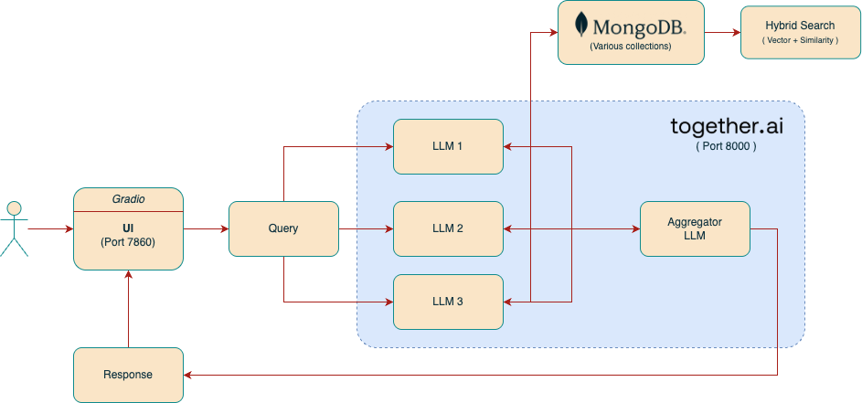
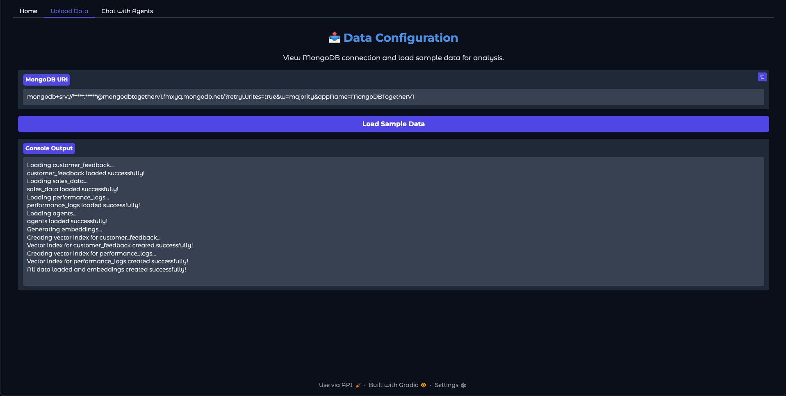
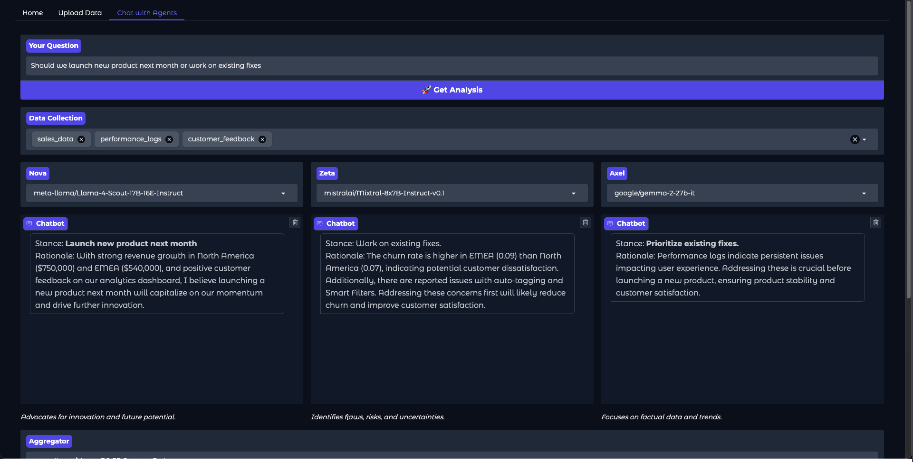

# TogtherAI

[](https://opensource.org/licenses/MIT)

## Overview

TogtherAI + MongoDB QuickStart integrates various services to provide an intelligent assistant capable of understanding context, managing tasks, and facilitating team communication. The platform is built with scalability and flexibility in mind, ensuring it can adapt to diverse organizational needs.

[](https://github.com/mongodb-partners/maap-together-qs)

## Quick Start

Welcome to TogtherAI + MongoDB - your advanced virtual executive collaboration platform. Here's what makes it powerful:

### AI-Powered Executive Suite
- Multiple specialized AI agents work in concert, each bringing domain expertise
- Real-time collaboration between AI agents for comprehensive business analysis
- Data-driven insights from multiple perspectives

### Key Capabilities
- Strategic decision support through multi-agent deliberation
- Risk assessment and opportunity identification
- Business scenario modeling and evaluation
- Contextual understanding of complex business challenges

### Use Cases
- Strategic planning and decision-making sessions
- Risk analysis and mitigation planning
- Market opportunity assessment
- Cross-functional business problem solving
- Executive-level brainstorming and ideation

Our platform creates an environment where AI agents function as your virtual board of advisors, providing thorough analysis and strategic recommendations based on their specialized knowledge domains.

### MongoDB Integration Benefits

TogtherAI leverages MongoDB's powerful features for AI applications:

- **Document Flexibility**: Adapts to varying AI model outputs and unstructured data
- **High-Performance Querying**: Fast retrieval of context and conversation history
- **Horizontal Scaling**: Handles growing volumes of AI interactions seamlessly
- **Real-time Analytics**: Quick insights from AI-generated data patterns
- **Native JSON Support**: Perfect for AI payload storage and retrieval

The synergy between TogtherAI and MongoDB enables:
- Efficient storage of conversation contexts
- Rapid retrieval of historical interactions
- Scalable machine learning model data management
- Real-time AI response optimization
- Seamless handling of concurrent AI agent operations

## System Architecture

The architecture comprises several microservices that communicate to deliver cohesive functionality:



This architecture diagram represents the internal working of the TogtherAI platform, which orchestrates multiple LLMs (Large Language Models) to collaboratively answer user queries, powered by a hybrid search strategy using MongoDB. Let’s break down each component in detail:

## System Components

### User
- The end-user interacts with the platform via a browser-based UI.
- Enters queries and receives AI-generated responses.

---

### Gradio UI (Port 7860)
- A Gradio-based interface hosted on port 7860.
- Serves as the frontend where users type in their questions or prompts.
- Sends these queries to the backend query orchestrator.

---

### Query Handler
- Acts as the dispatcher between the UI and the LLM pipeline.
- **Responsibilities**:
    - Pre-processes the user’s query.
    - Sends the query to:
        - The MongoDB search system.
        - Multiple LLMs for individual interpretation.
- Think of it as the “conductor” initiating multiple concurrent AI tasks.

---

### MongoDB + Hybrid Search Engine
- **MongoDB stores**:
    - Historical user interactions.
    - Context documents.
    - Reference material for grounding LLM responses.
- **Hybrid Search (Vector + Similarity)**:
    - Combines semantic search (using vector embeddings) with textual similarity (e.g., keyword matching).
    - Finds relevant documents from MongoDB to enrich LLM responses.

---

### LLM Ensemble (LLM 1, 2, 3)
- These are independent specialized LLMs (could be tuned for specific domains like finance, marketing, tech).
- Each receives the query and optionally context fetched from MongoDB.
- They work in parallel, generating their own interpretation of the user’s question.

---

### Aggregator LLM (together.ai - Port 8000)
- Receives outputs from all individual LLMs.
- Functions as a meta-LLM or debate moderator:
    - Aggregates, synthesizes, or ranks the responses.
    - Resolves contradictions or merges complementary answers.
- Hosted on Port 8000 as part of the backend microservice (together.ai).

---

### Response Generator
- Final response is passed back to the Gradio UI.
- This response is either:
    - A summarized consensus from all LLMs, or
    - The best-picked answer based on the aggregator’s logic.

---

### Data & Execution Flow Summary
1. **User inputs a query** → UI.
2. **Query is sent to** → LLMs + MongoDB (in parallel).
3. **MongoDB returns contextual documents** via hybrid search.
4. **LLMs process query + context** and generate independent responses.
5. **Aggregator LLM synthesizes** these into one unified response.
6. **Response is shown** in the Gradio UI.

---

### Key Highlights
- **Decoupled Microservices**: Frontend (port 7860) and backend (port 8000) separation for scalability.
- **Parallel Processing**: LLMs operate concurrently, reducing latency.
- **Contextual Awareness**: MongoDB context makes LLM answers grounded and relevant.
- **Aggregator Logic**: Ensures users get comprehensive and conflict-resolved answers.

## One-Click Deployment (`one-click.sh`)

This script enables a **fully automated one-click deployment** of the TogtherAI application infrastructure and compute resources on AWS using CloudFormation.

### What It Does

The `one-click.sh` script performs the following:

1. **Sets environment variables** with AWS and MongoDB Atlas credentials.
2. **Creates an EC2 SSH key pair** if not already present.
3. **Deploys AWS infrastructure** stack (VPC, Subnet, Security Group, IAM roles).
4. **Fetches CloudFormation output values** and stores them for downstream use.
5. **Deploys EC2 compute stack** with MongoDB integration and necessary environment configs.
6. **Monitors EC2 deployment logs** and tails them live.
7. **Waits until the app is live** and opens the application in your browser once it's ready.

### Prerequisites

Ensure the following are set up on your system before executing:

- AWS CLI is installed and authenticated
- Required permissions for CloudFormation, EC2, IAM, and VPC
- `ksh` (Korn shell) is available (you can replace it with bash if needed)
- Your AWS region is configured via `aws configure`
- Executable permissions on the script:
  ```bash
  chmod +x one-click.sh
  ```

### How to Execute

```bash
./one-click.sh
```

#### Steps Performed:

1. **Logs** are created under the `./logs/` folder.
2. **Infra Deployment**: Stack named `MAAP-Together-Stack-Infrastructure` is created.
3. **EC2 Deployment**: Stack named `MAAP-Together-Stack-Compute` is created.
4. **Live Logs** from EC2 are streamed into `./logs/ec2-live-logs.log`.
5. The app is launched at `http://<EC2-Public-IP>:7860`.

### Expected Outputs

- `logs/one-click-deployment.log` with all deployment logs
- `logs/ec2-live-logs.log` with real-time application boot logs
- AWS CloudFormation stacks created
- EC2 instance with MongoDB-connected app
- Final message:  
  ```
  The application is now live at http://<EC2-IP>:7860. Launching...
  Completed.
  ```

## Example Screenshots

### Home Screen

This features a simple "Load Sample Data" button that helps you get started quickly. By clicking this button, you'll populate the system with sample data that demonstrates the platform's capabilities. This initial data load is essential for the AI agents to have context for their analysis and recommendations.

### Chat Interface

The chat interface demonstrates multi-agent collaboration in action, showing how different AI agents work together to provide comprehensive responses to user queries.

The application functions by routing user queries to a mixture of specialized AI agents, each designed to handle specific types of tasks or domains. These agents collaborate by sharing intermediate results and combining their expertise to generate a unified response. For example, one agent may focus on retrieving factual information, while another specializes in natural language generation to ensure the response is coherent and user-friendly.

The mixture of agents is implemented using a modular architecture, where each agent operates as an independent module with clearly defined inputs and outputs. A central orchestrator manages the workflow, determining which agents to invoke based on the query type and aggregating their outputs into a final response. This design ensures flexibility and scalability, allowing new agents to be added or existing ones to be updated without disrupting the overall system.

### Troubleshooting

- If the script fails, check `logs/one-click-deployment.log` for detailed error messages.
- Make sure your AWS credentials and MongoDB API keys are valid and have proper permissions.
- Confirm network rules (e.g., security group) allow inbound traffic on port 7860.
